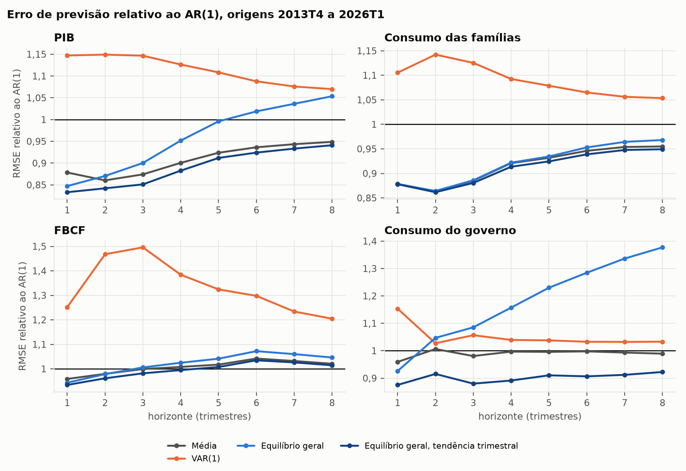
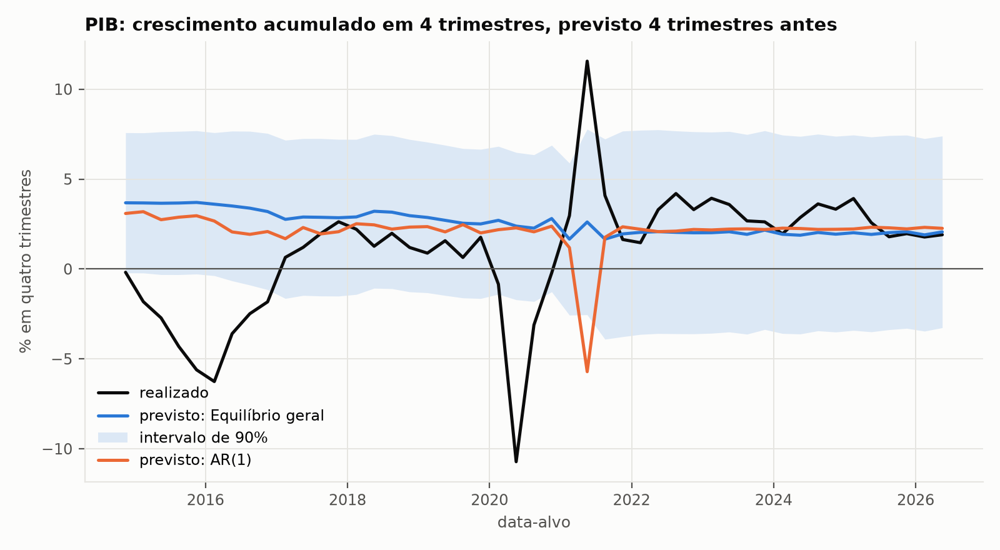
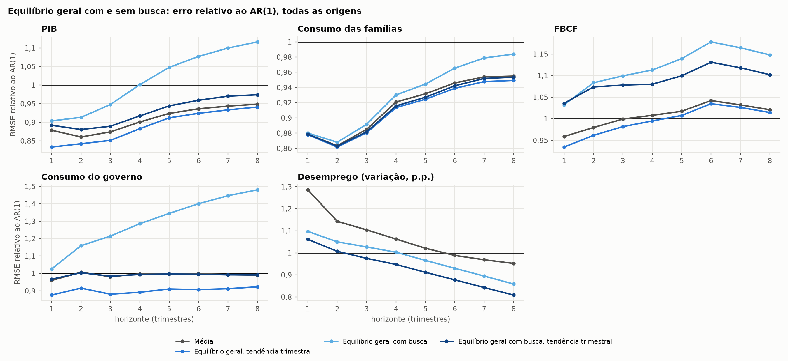

# Previsão fora da amostra para o Brasil, 2013T4–2026T2

Esta pasta compara modelos de equilíbrio geral e modelos baseados em agentes,
calibrados para o Brasil, com modelos estatísticos simples naquela que talvez
seja a prova mais direta para um modelo macroeconômico, a de prever dados que
ele não viu. As origens das previsões vão de 2013T4 a 2026T2, e os dados
começam em 1996.

| Pasta | Modelo |
|---|---|
| [`referencias/`](referencias/README.md) | média histórica, AR(1) e VAR(1) |
| [`dsge/`](dsge/README.md) | equilíbrio geral estocástico, o Ramsey com governo de [`Politicas/Lei-15270/equilibrio_geral/`](../../../Politicas/Lei-15270/equilibrio_geral/README.md) sujeito a choques |
| [`dsge_busca/`](dsge_busca/README.md) | o mesmo com margem, busca no mercado de trabalho e salário rígido |
| [`abm1_com_leiloeiro/`](abm1_com_leiloeiro/README.md) | ABM com 20 mil famílias e leiloeiro walrasiano |
| [`abm2_sem_leiloeiro/`](abm2_sem_leiloeiro/README.md) | ABM sem leiloeiro, com firmas, preços, salários e busca |

O protocolo comum (`protocolo.py`, `avaliacao.py` e `espaco_estados.py`), a
comparação (`comparacao.py`), os resultados e as figuras ficam nesta pasta.
Os quatro modelos estruturais formam dois pares com os mesmos fundamentos, e
dentro de cada par a diferença entre os dois mede o que muda quando os preços
deixam de vir de um equilíbrio e passam a sair das decisões dos agentes, com
o par de baixo prevendo também o desemprego.

| | Com leiloeiro ou equilíbrio | Sem leiloeiro |
|---|---|---|
| Sem desemprego nem margem | equilíbrio geral (`dsge/`) | ABM 1, com leiloeiro (`abm1_com_leiloeiro/`) |
| Com desemprego de busca e margem de 10% | equilíbrio geral com busca (`dsge_busca/`) | ABM 2, sem leiloeiro (`abm2_sem_leiloeiro/`) |

## Protocolo

Os dados vêm das Contas Nacionais Trimestrais do IBGE, de 1996T1 a 2026T2, em
índices de volume com ajuste sazonal, e as variáveis previstas são o
crescimento trimestral do PIB, do consumo das famílias, da FBCF e do consumo
do governo, além da variação da taxa de desemprego da PNAD Contínua (tabela
4099) a partir de 2012. O desemprego é dessazonalizado por decomposição
clássica, com uma média móvel centrada 2x4 e um fator fixo para cada
trimestre do ano, estimado com a amostra inteira, como na dessazonalização
das Contas Nacionais que o IBGE publica hoje.

As origens vão de 2013T4 a 2026T1, uma por trimestre, e em cada origem T cada
modelo é reestimado apenas com os dados até T, numa janela que cresce desde
1996, para prever o crescimento acumulado de T+1 a T+h, com h de 1 a 8
trimestres. A calibração respeita o que se sabia na data, de modo que a parte
estrutural dos modelos usa apenas dados anuais até o ano de T menos 2, já que
PWT, Ipea e IBGE são publicados com defasagem, e os ABMs usam a PNAD apenas
até T, com testes que conferem que alterar qualquer dado posterior à origem
não muda nenhuma previsão.

A avaliação usa a raiz do erro quadrático médio (RMSE) relativa à do AR(1), o
CRPS, que avalia a previsão de densidade inteira, a cobertura do intervalo de
90% e o teste de Diebold e Mariano com a correção de Harvey, Leybourne e
Newbold (1997) para amostras pequenas. São 50 origens com realizado em h = 1
e 43 em h = 8, e como a pandemia domina qualquer medida de erro, todos os
resultados aparecem também sem as janelas de previsão que tocam 2020T2 a
2020T4.

## Modelos

As referências são estimadas por mínimos quadrados em cada origem e incluem a
média histórica do crescimento, que equivale a um passeio aleatório com
deriva no nível, um AR(1) para cada variável e um VAR(1) com as quatro
variáveis das Contas Nacionais. A média e o AR(1) preveem também o
desemprego, com a amostra disponível desde 2012, o que não é feito no VAR(1)
porque ele perderia dezesseis anos das outras séries.

O equilíbrio geral (`dsge/`) é o modelo de Ramsey com governo da primeira
parte de `Politicas/Lei-15270/equilibrio_geral/`, escrito em tempo discreto
trimestral e sujeito a três choques. O primeiro atinge a tendência, com o
crescimento da produtividade do trabalho oscilando em torno de $g$ segundo
$\log \Gamma_t = g/4 + u_t$, em que $u_t$ segue um AR(1), e corresponde ao
choque permanente de Aguiar e Gopinath (2007), importante nos ciclos de
economias emergentes. O segundo é um choque transitório de produtividade, com
$Y_t = e^{z_t} K_t^\alpha (A_t L_t)^{1-\alpha}$ e $z_t$ também AR(1), e o
terceiro atinge o gasto público, com $G_t/(A_t L_t) = \bar g\, e^{s_t}$. A
família escolhe o consumo pela equação de Euler

$$
x_t^{-\theta} = e^{-\rho/4}\, E_t\!\left[x_{t+1}^{-\theta}\left(1 + \tfrac14 (1-\tau_k)(R_{t+1} - \delta)\right)\right],
$$

com $x = C/L$, e quando o período tende a zero o estado estacionário e a
velocidade de convergência tendem exatamente aos de `modelo.py`, como um dos
testes verifica. O modelo é linearizado em logaritmos e resolvido pelo método
de Klein (2000). Os parâmetros estruturais, que são $\alpha$, $\delta$, $n$,
$g$, $\tau_k$, $G/Y$, $\theta = 2$ e o $\rho$ que reproduz $K/Y$, vêm da mesma
calibração anual de `Politicas/Lei-15270/equilibrio_geral/calibracao.py`,
refeita em cada origem, enquanto os seis parâmetros dos choques e os quatro
erros de medida são estimados por máxima verossimilhança com o filtro de
Kalman.

A versão com tendência trimestral faz duas mudanças que isolam a dinâmica do
modelo do erro de tendência. O crescimento de tendência $g + n$ passa a
reproduzir o crescimento médio do PIB trimestral até a origem, em vez da
tendência anual desde 2000, e cada série ganha a própria média de
crescimento, o que importa porque o gasto real, por exemplo, cresce menos que
o PIB nos dados, já que o preço relativo dos serviços públicos sobe. Com as
mesmas médias da média histórica, a comparação entre os dois mede apenas o
que a dinâmica do modelo acrescenta.

O equilíbrio geral com busca (`dsge_busca/`) recebe os fundamentos do ABM sem
leiloeiro. Há concorrência monopolística com margem de 10% sobre o custo
marginal, próxima da que emerge no ABM 2, de modo que capital e trabalho
recebem o produto marginal dividido por 1,10 e, com a mesma tecnologia
($\alpha$), a participação do trabalho cai para 50%, como no ABM 2, com $\rho$
recalibrado para reproduzir o $K/Y$ na presença da margem. O emprego vira uma
variável de estado, $N_t = (1-s_t)N_{t-1} + f_t(1-N_{t-1})$, e quem acabou de
perder o emprego espera o trimestre seguinte para procurar outro, como no
ABM. A separação $s$ e o desemprego de longo prazo vêm da mesma cadeia
trimestral da PNAD usada no ABM, calibrada até a origem, enquanto $f$ sai de
uma função de encontro com elasticidade de 0,5, e as firmas abrem vagas até
que o custo de contratar, de 14% do salário de um trimestre segundo Silva e
Toledo (2009), com vagas preenchidas com probabilidade de 0,7 por trimestre,
se iguale ao valor do trabalhador. O salário acompanha a tendência da
produtividade, mas só se ajusta aos poucos ao produto marginal, segundo
$\log w_t = \gamma(\log w_{t-1} - u_t) + (1-\gamma)\log(\omega\,\mathrm{PMgL}_t)$,
como em Hall (2005) e Blanchard e Galí (2010), o que cumpre o papel da regra
de salários do ABM, com a rigidez $\gamma$ estimada. Um quarto choque, na
taxa de separação e também AR(1), dá ao desemprego uma fonte própria de
variação, como a separação que o ABM usa para reproduzir a PNAD. Ao todo são
nove parâmetros de choques e rigidez e cinco erros de medida, estimados por
máxima verossimilhança, com o desemprego tratado como observação faltante
antes de 2012 e as mesmas duas versões de tendência do modelo sem busca.

O ABM 1 (`abm1_com_leiloeiro/`) entra com as cinco variantes de expectativas
do [modelo baseado em agentes](abm1_com_leiloeiro/README.md), cujas famílias
heterogêneas chegam à origem num estado que resulta de uma simulação da
história desde 1996 guiada pelos dados, e as previsões vêm de 200 simulações.
O ABM 2 (`abm2_sem_leiloeiro/`) é a economia com 200 firmas que fixam preços
e salários, busca por emprego e mercado de bens com fornecedores, com as
mesmas cinco regras de expectativas. Em cada origem ele recebe a mesma
calibração do ABM 1, com os desempregados fora da produção, passa por 100
anos de aquecimento sem choques, para que margens, estoques, capital e
crenças cheguem ao regime do próprio ABM, e percorre a história de 1996 até a
origem reproduzindo o PIB, por meio do crescimento da produtividade, o gasto
do governo e, desde 2012, a taxa de desemprego da PNAD, por meio da
probabilidade de separação de cada trimestre, antes de os três choques
seguirem AR(1) nas 200 simulações da previsão.

## Resultados

As tabelas mostram o RMSE relativo ao do AR(1), de modo que valores abaixo de
1 indicam que o modelo errou menos que o AR(1), e os números em negrito são
diferenças significativas a 5% pelo teste de Diebold-Mariano. As tabelas
completas, com todos os horizontes e o CRPS, estão em
`resultados/avaliacao.csv` e `resultados/avaliacao_sem_pandemia.csv`, e as
previsões de cada modelo ao lado do realizado estão em
`resultados/previsoes_contra_realizado.csv`.

### Equilíbrio geral contra as referências

| Variável | Modelo | h=1 | h=4 | h=8 | h=1 sem pandemia | h=4 sem pandemia | h=8 sem pandemia |
|---|---|---|---|---|---|---|---|
| PIB | Média | 0,88 | 0,90 | 0,95 | 1,07 | 1,05 | 1,03 |
| PIB | VAR(1) | 1,15 | 1,13 | 1,07 | 0,92 | 0,95 | 0,97 |
| PIB | Equilíbrio geral | 0,85 | 0,95 | 1,05 | **1,11** | 1,16 | 1,16 |
| Consumo das famílias | Média | 0,88 | 0,92 | 0,95 | **1,08** | 1,05 | 1,03 |
| Consumo das famílias | VAR(1) | 1,11 | 1,09 | 1,05 | 0,95 | 0,95 | 0,98 |
| Consumo das famílias | Equilíbrio geral | 0,88 | 0,92 | 0,97 | **1,08** | 1,06 | 1,07 |
| FBCF | Média | 0,96 | 1,01 | 1,02 | 1,04 | 1,09 | 1,06 |
| FBCF | VAR(1) | 1,25 | 1,38 | 1,20 | 0,90 | 0,94 | 0,96 |
| FBCF | Equilíbrio geral | 0,94 | 1,03 | 1,05 | 1,04 | 1,13 | 1,10 |
| Consumo do governo | Média | 0,96 | 1,00 | 0,99 | **0,88** | 0,96 | **0,97** |
| Consumo do governo | VAR(1) | 1,15 | **1,04** | 1,03 | **1,18** | 1,06 | 1,05 |
| Consumo do governo | Equilíbrio geral | 0,93 | 1,16 | 1,38 | 0,95 | 1,28 | 1,49 |
| PIB | Equilíbrio geral, tendência trimestral | 0,83 | 0,88 | 0,94 | 1,03 | 1,03 | 1,02 |
| Consumo das famílias | Equilíbrio geral, tendência trimestral | 0,88 | 0,91 | 0,95 | 1,07 | 1,04 | 1,04 |
| FBCF | Equilíbrio geral, tendência trimestral | 0,93 | 1,00 | 1,02 | 1,02 | 1,08 | 1,05 |
| Consumo do governo | Equilíbrio geral, tendência trimestral | **0,88** | **0,89** | **0,92** | **0,85** | **0,88** | 0,92 |



Com 50 origens, apenas diferenças grandes poderiam ser detectadas, e de fato
quase nada é significativo, com exceção do equilíbrio geral com tendência
trimestral no consumo do governo, que erra de 8% a 15% menos que o AR(1). A
pandemia inverte o ordenamento, porque com ela o AR(1) e o VAR(1) sofrem ao
extrapolar a queda de 2020T2 e a recuperação que se seguiu, enquanto a média
e o equilíbrio geral, que voltam logo à tendência, erram menos. Sem a
pandemia, o VAR(1) passa a ser o melhor e o equilíbrio geral erra de 6% a 16%
mais que o AR(1) no PIB e no consumo, com diferença significativa em h = 1.

A maior parte da desvantagem do equilíbrio geral vem da tendência. Todos os
modelos superestimaram o crescimento a partir de 2014, mas ele mais que os
outros, com um viés médio de −3,4 p.p. no PIB em 8 trimestres fora da
pandemia, contra −2,7 do AR(1), porque sua tendência sai da calibração anual,
de 3,6% a 3,8% ao ano nas origens de 2013 a 2016 com dados a partir de 2000,
enquanto as referências usam a média desde 1996. Com a tendência trimestral,
o mesmo modelo passa a ser o melhor na amostra completa para o PIB, com 17% a
6% menos erro que o AR(1) de h = 1 a h = 8, e fora da pandemia erra apenas 2%
a 3% mais que o AR(1). Contra a média histórica, que tem as mesmas médias, ele
erra de 1% a 5% menos no PIB, o que indica que a dinâmica estrutural
acrescenta pouco, mas acrescenta.

O crescimento balanceado custa caro no consumo do governo, porque o modelo
obriga o gasto real a crescer no ritmo do PIB quando nos dados ele cresceu
1,7% ao ano, contra 2,3% do PIB, em razão da alta do preço relativo dos
serviços públicos, e daí vem um viés de −4,0 p.p. em 8 trimestres fora da
pandemia, contra −1,6 do AR(1). Com a média própria de cada série o problema
desaparece e o consumo do governo passa a ser a variável em que o modelo
mais ganha. Os intervalos de 90% cobrem menos do que deveriam nos horizontes
longos em todos os modelos, entre 74% e 81% para o PIB em h = 8, com o
equilíbrio geral no nível da média histórica. Os parâmetros dos choques
também mudam quando 2020T2 entra na amostra, com a persistência do choque de
gasto caindo de 0,99 para −0,04 e a do choque de tendência de 0,57 para −0,35
(`resultados/parametros_dsge.csv`), porque um trimestre em que todas as
séries caem de 8% a 17% pesa muito numa verossimilhança normal, e no
equilíbrio geral com busca a rigidez estimada do salário cai de 0,45 a 0,62
para zero.



### Os quatro modelos estruturais

A primeira tabela mostra o RMSE relativo ao AR(1) em 4 trimestres, com a
amostra toda e sem as janelas da pandemia.

| Modelo | PIB | PIB sem pandemia | Consumo | Consumo sem pandemia | FBCF | FBCF sem pandemia | Desemprego | Desemprego sem pandemia |
|---|---|---|---|---|---|---|---|---|
| Média | 0,90 | 1,05 | 0,92 | 1,05 | 1,01 | 1,09 | 1,06 | 1,23 |
| VAR(1) | 1,13 | 0,95 | 1,09 | 0,95 | 1,38 | 0,94 | — | — |
| Equilíbrio geral (tend. trimestral) | 0,88 | 1,03 | 0,91 | 1,04 | 0,99 | 1,08 | — | — |
| Equilíbrio geral com busca (tend. trimestral) | 0,92 | 1,05 | 0,92 | 1,04 | 1,08 | 1,15 | 0,95 | 0,97 |
| ABM 1: crenças fixas | 1,02 | 1,00 | 0,98 | 0,96 | 1,09 | 1,08 | — | — |
| ABM 1: aprendizado | 1,03 | 1,02 | 0,99 | 1,00 | 1,14 | 1,06 | — | — |
| ABM 1: heurísticas | 0,99 | 0,95 | 0,99 | 1,13 | 1,33 | 0,82 | — | — |
| ABM 1: informação rígida | 1,03 | 1,03 | 0,99 | 0,98 | 1,16 | 1,11 | — | — |
| ABM 1: atenção limitada | 0,99 | 0,95 | 0,93 | 0,99 | 1,29 | 0,99 | — | — |
| ABM 2: crenças fixas | 0,98 | 0,99 | 0,95 | 0,98 | 1,10 | 1,03 | 0,98 | 1,09 |
| ABM 2: aprendizado | 0,96 | **1,08** | 0,93 | 1,00 | 1,09 | 1,12 | 0,89 | 0,96 |
| ABM 2: heurísticas | 1,01 | **1,12** | 1,07 | 1,32 | **1,57** | **1,80** | 1,04 | 1,14 |
| ABM 2: informação rígida | 0,91 | 1,03 | 0,88 | 0,97 | 1,05 | 1,07 | 1,00 | 1,12 |
| ABM 2: atenção limitada | 1,00 | **1,20** | 1,13 | **1,35** | **1,54** | **1,76** | 1,05 | 1,18 |

A segunda mostra o mesmo em 8 trimestres.

| Modelo | PIB | PIB sem pandemia | Consumo | Consumo sem pandemia | FBCF | FBCF sem pandemia | Desemprego | Desemprego sem pandemia |
|---|---|---|---|---|---|---|---|---|
| Média | 0,95 | 1,03 | 0,95 | 1,03 | 1,02 | 1,06 | 0,95 | 1,08 |
| VAR(1) | 1,07 | 0,97 | 1,05 | 0,98 | 1,20 | 0,96 | — | — |
| Equilíbrio geral (tend. trimestral) | 0,94 | 1,02 | 0,95 | 1,04 | 1,01 | 1,05 | — | — |
| Equilíbrio geral com busca (tend. trimestral) | 0,97 | 1,05 | 0,95 | 1,04 | 1,10 | 1,14 | 0,81 | 0,87 |
| ABM 1: crenças fixas | 1,02 | 1,01 | 0,97 | 0,96 | 1,08 | 1,07 | — | — |
| ABM 1: aprendizado | 1,04 | 1,03 | 1,00 | 1,01 | 1,15 | **1,05** | — | — |
| ABM 1: heurísticas | 1,00 | 0,96 | 1,02 | 1,11 | 1,17 | 0,85 | — | — |
| ABM 1: informação rígida | 1,04 | 1,04 | 1,00 | 0,99 | **1,17** | 1,08 | — | — |
| ABM 1: atenção limitada | 1,00 | 0,96 | 0,96 | 1,00 | 1,18 | 0,98 | — | — |
| ABM 2: crenças fixas | 0,97 | 0,96 | 0,95 | 0,98 | 1,04 | 1,03 | 0,78 | 0,89 |
| ABM 2: aprendizado | **0,95** | 0,99 | 0,94 | 0,98 | 1,07 | **1,08** | 0,76 | 0,86 |
| ABM 2: heurísticas | 1,07 | **1,07** | **1,15** | 1,25 | **1,68** | **1,71** | 1,00 | 1,00 |
| ABM 2: informação rígida | 0,94 | 0,99 | 0,90 | 0,97 | 1,03 | 1,06 | 0,82 | 0,93 |
| ABM 2: atenção limitada | 1,01 | 1,11 | 1,14 | **1,26** | **1,45** | **1,47** | 0,85 | 0,98 |

O desemprego aparece como a variação da taxa entre a origem e o alvo, tendo
como referência o AR(1) dessa variação, e o consumo do governo, que é
exógeno nos ABMs, fica fora das tabelas.


Nenhum modelo domina os demais, já que quase nenhuma diferença é
significativa e o melhor modelo muda com a variável, com o horizonte e com a
inclusão da pandemia. Pôr margem e busca no equilíbrio geral não melhora a
previsão das Contas Nacionais, pois com a tendência trimestral e a amostra
toda o RMSE do modelo com busca fica de 3% a 7% acima do modelo sem busca no
PIB e de 9% a 12% acima na FBCF, de 1 a 8 trimestres, e o que ele acrescenta
de fato é o desemprego.

É no desemprego, aliás, que os modelos com busca ganham. Em um trimestre nada
supera o AR(1), porque a taxa é muito persistente, mas em um e dois anos os
dois modelos com busca erram menos que o AR(1) e que a média, com 24% menos
erro no ABM 2 com aprendizado e 19% menos no equilíbrio geral com busca em 8
trimestres (14% e 13% sem a pandemia), ainda que sem significância. A razão é
a mesma nos dois casos, já que ambos trazem o desemprego de volta à média da
PNAD enquanto as referências extrapolam a tendência recente, e por isso o
viés em 8 trimestres fora da pandemia é de +0,07 p.p. no equilíbrio geral com
busca e de −0,23 no ABM 2 com aprendizado, contra −0,99 no AR(1).

Sem leiloeiro, com as regras que não reagem demais aos preços correntes, o ABM
2 fica no nível do seu par. Com crenças fixas, aprendizado e informação
rígida, ele erra mais ou menos o mesmo que o equilíbrio geral com busca no PIB
e um pouco menos no consumo, e com informação rígida erra 12% menos que o
AR(1) em 4 trimestres e 10% menos em 8, o melhor resultado de todos os
modelos para o consumo na amostra toda. No desemprego em dois anos, com
crenças fixas e aprendizado, ele erra um pouco menos que o par, e na FBCF
fora da pandemia fica entre 1,03 e 1,12 vezes o AR(1), contra 1,14 e 1,15 do
par.

Com heurísticas e atenção limitada, por outro lado, o ABM 2 é instável e
resulta nos piores modelos para a FBCF, com erros de 45% a 80% maiores que os
do AR(1), significativos em 4 e 8 trimestres. No ABM 2 o retorno do capital é
o lucro realizado do fundo, que oscila de um trimestre para outro, e essas
duas regras o levam quase diretamente às crenças, de modo que o custo do
capital das firmas e o consumo oscilam junto, e com heurísticas as famílias
ainda trocam de regra em bloco, passando todas para a regra ingênua e, poucos
trimestres depois, para a fundamentalista. No ABM 1, em que o retorno é dado
pelo produto marginal, as mesmas regras produzem os melhores resultados para
a FBCF fora da pandemia. Por fim, os intervalos de 90% do desemprego cobrem
apenas de 66% a 74% dos valores realizados em 4 trimestres, nos modelos com
busca e no AR(1), o que mostra que todos subestimam a incerteza sobre o
desemprego.



Os resultados de cada ABM são discutidos com mais detalhe no README do
[ABM 1](abm1_com_leiloeiro/README.md#previsão-fora-da-amostra) e no do
[ABM 2](abm2_sem_leiloeiro/README.md#previsão-fora-da-amostra).


## Previsões registradas

As previsões feitas com os dados até 2026T2 ficam gravadas em
`resultados/previsao_registrada_202602.csv`, para serem comparadas com os
dados que o IBGE ainda vai divulgar. A tabela traz o crescimento acumulado
desde 2026T2, em %, e a variação da taxa de desemprego desde 2026T2, quando
estava em 5,3%, em p.p.

| Modelo | PIB até 2026T4 | PIB até 2027T4 | Consumo até 2026T4 | Consumo até 2027T4 | FBCF até 2027T4 | Desemprego até 2026T4 | Desemprego até 2027T4 |
|---|---|---|---|---|---|---|---|
| Média | 1,14 | 3,42 | 1,23 | 3,70 | 3,17 | −0,08 | −0,23 |
| AR(1) | 1,13 | 3,39 | 1,21 | 3,63 | 3,23 | −0,31 | −0,63 |
| VAR(1) | 1,23 | 3,49 | 1,37 | 3,78 | 3,04 | — | — |
| Equilíbrio geral | 0,97 | 2,93 | 0,98 | 2,92 | 2,61 | — | — |
| Equilíbrio geral, tendência trimestral | 1,06 | 3,24 | 1,15 | 3,45 | 2,94 | — | — |
| Equilíbrio geral com busca | 1,11 | 2,96 | 0,99 | 2,94 | 2,71 | −0,04 | +0,49 |
| Equilíbrio geral com busca, tendência trimestral | 1,23 | 3,32 | 1,17 | 3,49 | 3,20 | −0,03 | +0,50 |
| ABM 1: crenças fixas | 1,14 | 3,35 | 1,10 | 3,28 | 3,95 | — | — |
| ABM 1: aprendizado | 0,86 | 2,49 | 1,04 | 3,03 | 0,38 | — | — |
| ABM 1: heurísticas | 0,95 | 3,07 | 1,33 | 3,89 | 0,43 | — | — |
| ABM 1: informação rígida | 0,84 | 2,45 | 1,08 | 3,15 | −0,16 | — | — |
| ABM 1: atenção limitada | 1,11 | 3,27 | 1,09 | 3,33 | 3,14 | — | — |
| ABM 2: crenças fixas | 1,51 | 3,49 | 1,16 | 3,56 | 1,12 | −0,66 | +0,25 |
| ABM 2: aprendizado | 0,40 | 2,17 | 1,22 | 3,74 | 1,07 | +1,22 | +2,72 |
| ABM 2: heurísticas | 0,40 | 2,69 | 7,39 | 8,80 | 15,84 | +0,55 | +1,90 |
| ABM 2: informação rígida | 2,72 | 3,03 | 1,39 | 4,10 | −3,83 | +0,73 | +2,43 |
| ABM 2: atenção limitada | 3,14 | 4,84 | −1,05 | −6,85 | −35,16 | +0,86 | +2,08 |

Com o desemprego no menor nível da série, os modelos com busca preveem que ele
suba, em 0,5 p.p. até 2027T4 no equilíbrio geral e de 1,9 a 2,7 p.p. no ABM 2
com quatro das cinco regras. As previsões do ABM 2 com heurísticas e com
atenção limitada para o consumo e a FBCF não são críveis, pelo motivo
discutido acima, já que em 2026T2 a economia com atenção limitada está no
meio de um surto de investimento, com os estoques pela metade, e a economia
com heurísticas passa, na simulação, a ter todas as famílias usando a regra
ingênua.

O arquivo traz também o desvio-padrão de cada previsão, que é grande, de 4 a 7
p.p. para o PIB até 2027T4 e de 1,4 a 3,8 p.p. para o desemprego, além da
coluna `efeito_lei`, com o efeito da Lei 15.270/2025 calculado pelo modelo
contínuo de `Politicas/Lei-15270/equilibrio_geral/` para o aumento de $\tau_k$
anunciado em março de 2025. Esse efeito é pequeno no horizonte das
previsões, de −0,05 p.p. no PIB e −0,08 p.p. no consumo até 2027T4, porque o
capital se ajusta devagar.

## Como rodar

Os comandos rodam a partir da pasta `Econometria/`, com as dependências de
`Python/requirements.txt`.

```bash
python Python/macroeconomia/Forecast/Brasil/2013T4-2026T2/comparacao.py --processos 4    # tudo, com 4 núcleos
python Python/macroeconomia/Forecast/Brasil/2013T4-2026T2/comparacao.py --modelos eg_busca abm2_apr   # só alguns modelos
python Python/macroeconomia/Forecast/Brasil/2013T4-2026T2/comparacao.py --sem-reestimar  # só tabelas e figuras
python Python/macroeconomia/rodar_testes.py Forecast   # os testes de todas as pastas da previsão
```

As chaves dos modelos são `media`, `ar1`, `var1`, `eg`, `eg_trim`,
`eg_busca`, `eg_busca_trim`, `abm_eq`, `abm_apr`, `abm_heu`, `abm_inf` e
`abm_aten` para o ABM 1 e `abm2_eq`, `abm2_apr`, `abm2_heu`, `abm2_inf` e
`abm2_aten` para o ABM 2, e com `--modelos` as previsões dos demais modelos
são lidas de `resultados/previsoes.csv`. Por origem, num núcleo, as
referências levam segundos, cada equilíbrio geral de meio minuto a um minuto
e meio e cada variante de ABM cerca de meio minuto, de modo que a rodada
completa leva de 2 a 3 horas com 4 núcleos. Os dados trimestrais ficam em
[`dados/brasil/`](../../../../../dados/brasil/README.md), junto com o script
que os baixa.

## Arquivos

| Arquivo ou pasta | Conteúdo |
|---|---|
| `protocolo.py` | dados, dessazonalização do desemprego, calibração em cada origem e previsões sem olhar o futuro |
| `espaco_estados.py` | filtro de Kalman, com observações faltantes, e previsão do crescimento acumulado, comuns aos modelos lineares |
| `avaliacao.py` | RMSE, CRPS, cobertura e teste de Diebold-Mariano |
| `comparacao.py` | roda o protocolo, em paralelo se pedido, e grava os resultados e as figuras |
| `referencias/` | média, AR(1) e VAR(1) |
| `dsge/` | equilíbrio geral estocástico, com estado estacionário, linearização, solução de Klein, espaço de estados e máxima verossimilhança |
| `dsge_busca/` | o mesmo com margem, busca, salário rígido e choque de separação |
| `abm1_com_leiloeiro/`, `abm2_sem_leiloeiro/` | os dois ABMs, com os próprios experimentos e testes |
| `test_*.py` (aqui e em cada pasta) | 49 testes nas pastas de referências, DSGEs e protocolo, que cobrem a solução exata de Brock-Mirman, o limite contínuo, a precisão da linearização, o estado estacionário e a dinâmica do modelo com busca, a verossimilhança do Kalman contra a normal multivariada e com dados faltantes, a recuperação dos parâmetros em dados simulados, a comparação com o `statsmodels`, a dessazonalização, o CRPS, o tamanho do teste de Diebold-Mariano e a ausência de dados do futuro |
| `resultados/` | previsões, avaliações contra o AR(1) e contra a média histórica, parâmetros estimados por origem, previsões lado a lado com o realizado (`previsoes_contra_realizado.csv`) e previsões registradas |
| `figuras/` | erros relativos por horizonte e previsões do PIB |

## Limitações

Os dados usados são os revisados de hoje, e não os que existiam em cada
origem, o que favorece um pouco todos os modelos, por igual. Nenhum modelo
tem setor externo, de modo que a diferença entre o PIB e a soma de consumo,
FBCF e gasto fica nos erros de medida, ou na variação dos estoques no caso do
ABM 2, e o primeiro equilíbrio geral e o ABM 1 também não têm desemprego. Como
o desemprego só existe desde 2012, nas primeiras origens a média e o AR(1) do
desemprego são estimados com menos de dez trimestres e o equilíbrio geral com
busca tem pouca informação sobre a rigidez do salário. Além disso, o
desemprego de longo prazo dos modelos com busca é a média da PNAD até a
origem, e quando a taxa passa muito tempo longe dela, como em 2016-2021 e
desde 2023, os dois modelos preveem que ela volte. Todos os modelos supõem
choques normais, algo de que a pandemia está muito longe, e a série de
consumo do governo tem um salto atípico no começo, de −16% em 1996T4 e +12%
em 1997T1, que entra em todas as amostras. Por fim, com 50 origens os testes
têm pouco poder, e apenas diferenças grandes aparecem como significativas.
