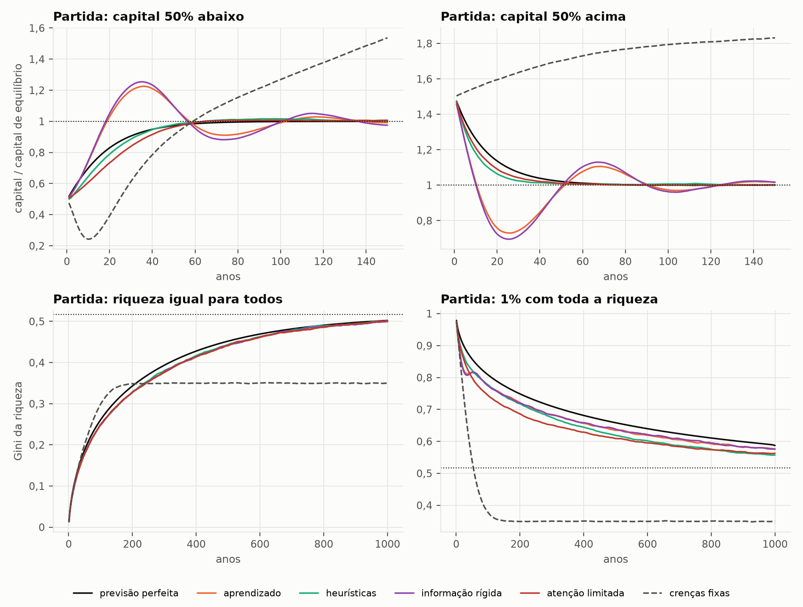
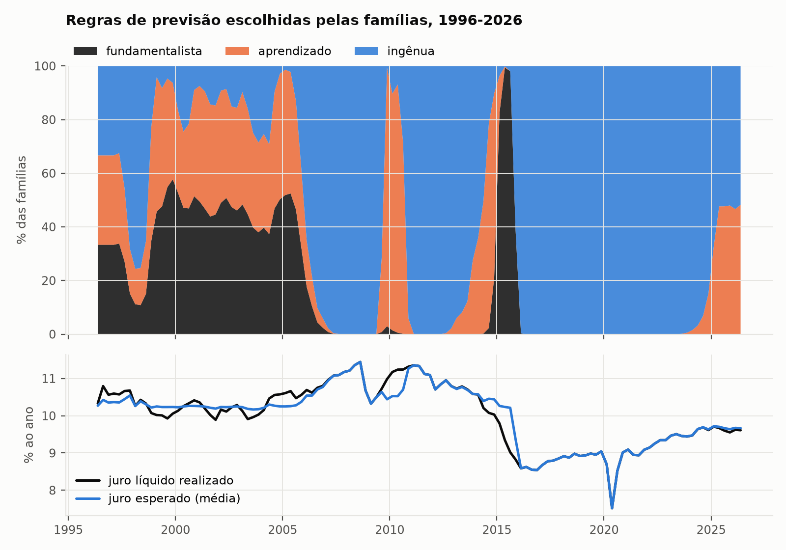
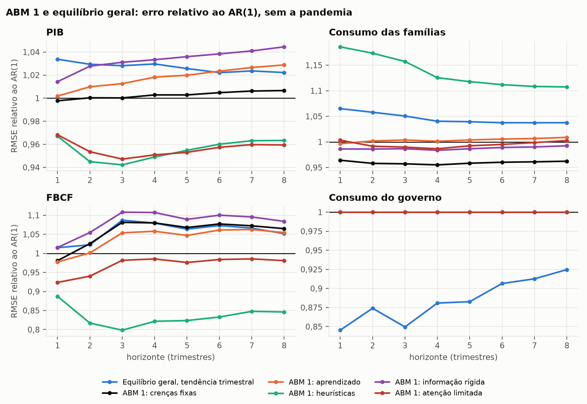

# ABM 1: com leiloeiro

Uma economia com 20 mil famílias simuladas uma a uma, trimestre a trimestre,
construída sobre a mesma microfundamentação neoclássica do modelo de Aiyagari
de [`Politicas/Lei-15270/equilibrio_geral/`](../../../../Politicas/Lei-15270/equilibrio_geral/README.md),
com a mesma calibração para o Brasil. A diferença está em como as famílias
formam expectativas, das expectativas racionais à racionalidade limitada da
literatura recente, e em que nada de equilíbrio é imposto ao longo do
caminho: os agregados são somas de decisões individuais. Os preços ainda vêm
de um leiloeiro walrasiano; o [ABM 2](../abm2_sem_leiloeiro/README.md) tira
o leiloeiro.

O modelo serve a três perguntas:

1. **O ABM prevê melhor que o equilíbrio geral?** Avaliado no protocolo fora
   da amostra desta pasta de previsão ([`../README.md`](../README.md)).
2. **A Lei 15.270/2025 tem os mesmos efeitos distributivos quando as famílias
   não são plenamente racionais?** Em
   [`Politicas/Lei-15270/`](../../../../Politicas/Lei-15270/README.md).
3. **O que emerge da interação?** A convergência a partir de longe do
   equilíbrio e as regras de previsão que as famílias escolhem ao longo da
   história brasileira recente.

## A economia

A cada trimestre:

1. a poupança do trimestre anterior vira riqueza por membro, descontado o
   crescimento da produtividade e da população;
2. cada família sorteia seu novo estado de renda pela cadeia de Markov
   calibrada com a PNAD Contínua: três tipos permanentes (50% com menor renda,
   40% seguintes, 10% com maior renda) e três situações (empregado,
   desempregado de curta e de longa duração);
3. um leiloeiro walrasiano fixa os preços que equilibram os mercados de
   fatores: $K$ é a riqueza média, $L$ a produtividade média, e a firma
   competitiva paga $r = (1-\tau_k)(\alpha Y/K - \delta)$ e
   $w = (1-\alpha)Y/L$;
4. o governo gasta $G$, cobra $\tau_k$ e $\tau_w$ e devolve o saldo como
   transferência;
5. cada família atualiza as crenças e escolhe quanto consumir;
6. o que sobra é poupado, e o investimento é $I = Y - C - G$.

**Microfundamentação.** Toda família resolve o problema de consumo e poupança
com utilidade CRRA e sem endividamento, pela equação de Euler

$$
c_t^{-\theta} = e^{-\rho/4}\,(1 + r_{t+1}/4)\,e^{-\theta g/4}\,E_t\!\left[c_{t+1}^{-\theta}\right],
$$

resolvida pelo método da grade endógena (Carroll, 2006). O que muda de uma
etapa para a outra é o que ela supõe sobre os juros e os salários futuros.
Com crenças $(r^e, w^e)$, ela age como se durassem para sempre
(*anticipated utility*, Kreps, 1998) e usa a política ótima para elas,
pré-calculada numa tabela de crenças de juro.

## Etapas da microfundamentação

| Etapa | Hipótese | Referência | Parâmetro |
|---|---|---|---|
| Previsão perfeita | conhece o caminho futuro de preços, consistente com as escolhas de todos (expectativas racionais sem risco agregado) | benchmark neoclássico | — |
| Crenças fixas | crê que os preços do estado estacionário valem para sempre (a regra "fundamentalista") | Brock e Hommes (1997) | — |
| Aprendizado | atualiza as crenças com ganho constante: $r^e \leftarrow r^e + \gamma (r - r^e)$ | Evans e Honkapohja (2001); Milani (2007) | $\gamma = 0{,}02$ |
| Heurísticas | cada família escolhe entre as regras fundamentalista, de aprendizado e ingênua (preços atuais), por um logit do erro passado de cada uma | Brock e Hommes (1997); Anufriev e Hommes (2012) | intensidade 1, memória 0,7 |
| Informação rígida | só 25% das famílias atualizam a informação a cada trimestre | Mankiw e Reis (2002); Carroll (2003) | $\lambda = 0{,}25$ |
| Atenção limitada | percebe só 85% do desvio dos preços em relação ao estado estacionário | Gabaix (2020) | $\bar m = 0{,}85$ |

A previsão perfeita é resolvida como um ponto fixo: dado um caminho para o
capital, a política de cada trimestre sai da grade endógena de trás para
frente, as famílias a seguem, e o capital que elas acumulam atualiza o
caminho até coincidir (`transicao.py`).

## Verificação

- **O ABM com previsão perfeita reproduz o Aiyagari contínuo.** No experimento
  da [Lei 15.270](../../../../Politicas/Lei-15270/README.md), o novo estado
  estacionário depois do aumento de $\tau_k$ tem capital −1,45% com devolução
  uniforme e −1,41% com isenção, os mesmos números de `Politicas/Lei-15270/equilibrio_geral/`.
  São duas soluções independentes: grade endógena trimestral com histograma
  aqui, HJB e Kolmogorov em tempo contínuo lá. Os ganhos de bem-estar por
  grupo também batem.
- **Solução analítica:** sem risco, a política coincide com a fórmula fechada
  do consumo com renda constante.
- **Equação de Euler:** vale com erro menor que 0,2% em pontos fora da grade.
- **Histograma e agentes:** 20 mil famílias sorteadas da distribuição
  estacionária a mantêm por 400 trimestres.
- **Contabilidade:** $Y = C + I + G$ e o orçamento do governo fecham a cada
  trimestre, e a poupança agregada é o capital mais o investimento líquido.
- **História:** o ABM reproduz o PIB e o gasto observados com erro de
  $10^{-14}$.
- **Sem olhar o futuro:** mudar qualquer dado posterior à origem (PIB, dados
  anuais, PNAD) não muda nenhuma previsão.
- **Previsão perfeita pelo histograma:** partindo da distribuição
  estacionária, o caminho fica no equilíbrio com erro menor que $10^{-6}$; o
  histograma das famílias sorteadas preserva a massa, a riqueza média e o
  peso de cada tipo; e as famílias simuladas seguem o caminho do contínuo
  por 20 anos com erro menor que 0,5%.
- **População estratificada:** o número exato de famílias em cada estado de
  renda. Um sorteio simples erra a oferta de trabalho em cerca de 1% (o tipo
  de maior renda produz 4 vezes a média), o que cria um déficit público que
  não existe no modelo e, na devolução por isenção, inverte o sinal do efeito
  sobre os mais pobres. Um teste impede que isso volte.

São 40 testes (`test_*.py`).

## O equilíbrio é imposto ou emergente?

Nos experimentos da Lei 15.270 a economia parte do equilíbrio estacionário. Em
`convergencia.py` ela parte de longe dele: a renda de cada família está no
estado estacionário, mas a riqueza não. São quatro partidas (capital 50%
abaixo, capital 50% acima, a mesma riqueza para todos e 1% das famílias com
toda a riqueza) e o próprio equilíbrio como controle, sem reforma e sem
choques agregados, por 1.000 anos. As crenças começam dos preços que as
famílias observam no primeiro trimestre: quem aprende não sabe onde fica o
equilíbrio.

Com previsão perfeita, a convergência é imposta, porque o caminho de preços
termina no estado estacionário por construção. Ela é calculada para um
contínuo de famílias, pelo histograma, e não para as 20 mil. Com famílias
simuladas seguindo um caminho de preços dado, o ruído de amostragem se
acumula: quem não reage aos preços realizados torna o equilíbrio instável, e
o desvio dobra a cada 20 anos, mais ou menos. A estabilidade do equilíbrio
com expectativas racionais vem de cada um refazer os planos, não do
comportamento das famílias. Nas outras regras ninguém impõe nada.

**Capital.** Anos até o capital entrar de vez na faixa de ±1% do equilíbrio
(entre parênteses, a faixa percorrida) e capital depois de 1.000 anos, em
relação ao de equilíbrio:

| Regra | Partindo 50% abaixo | Partindo 50% acima | Depois de 1.000 anos, todas as partidas |
|---|---|---|---|
| Previsão perfeita | 66 (0,50 a 1,00) | 62 (1,00 a 1,50) | 1,000 (1,007 partindo de 1% com tudo) |
| Crenças fixas | nunca | nunca | 1,84 |
| Aprendizado | 171 (0,50 a 1,23) | 224 (0,73 a 1,50) | 0,997 a 1,005 |
| Heurísticas | 118 (0,50 a 1,02) | 46 (0,99 a 1,50) | 0,997 a 1,004 |
| Informação rígida | 165 (0,50 a 1,25) | 155 (0,70 a 1,50) | 1,001 a 1,005 |
| Atenção limitada | 59 (0,50 a 1,01) | 50 (1,00 a 1,50) | 0,997 a 1,002 |

**Distribuição da riqueza.** Gini depois de 1.000 anos (no equilíbrio, 0,52)
e distância de Kolmogorov-Smirnov até a distribuição estacionária (a maior
diferença entre as funções de distribuição):

| Regra | Riqueza igual: Gini | Riqueza igual: distância | 1% com tudo: Gini | 1% com tudo: distância | Controle: distância |
|---|---|---|---|---|---|
| Previsão perfeita | 0,50 | 0,027 | 0,59 | 0,081 | 0,000 |
| Crenças fixas | 0,35 | 0,62 | 0,35 | 0,62 | 0,62 |
| Aprendizado | 0,50 | 0,038 | 0,58 | 0,067 | 0,013 |
| Heurísticas | 0,50 | 0,040 | 0,56 | 0,047 | 0,017 |
| Informação rígida | 0,50 | 0,040 | 0,58 | 0,071 | 0,018 |
| Atenção limitada | 0,50 | 0,037 | 0,56 | 0,051 | 0,012 |



1. **Com racionalidade limitada, o equilíbrio emerge.** Com aprendizado,
   heurísticas, informação rígida e atenção limitada, o capital volta ao
   equilíbrio de todas as partidas, sem que nada o imponha. O aprendizado e
   a informação rígida, que dependem só do passado, passam do ponto em
   ciclos longos e amortecidos: partindo de 50% abaixo, o juro fica alto por
   anos, as famílias passam a acreditar nele, poupam demais, e o capital
   chega a 1,23 vez o de equilíbrio antes de voltar. Levam de 155 a 225 anos
   para se acertar. As heurísticas e a atenção limitada, que ancoram parte
   das crenças no equilíbrio, chegam em 46 a 118 anos, às vezes mais rápido
   que a previsão perfeita.
2. **Com crenças fixas, a economia vai para outro lugar.** De todas as
   partidas, inclusive do próprio equilíbrio, o capital vai para 1,84 vez o
   de equilíbrio e o Gini para 0,35. É um ponto de repouso estável, o mesmo
   de todas as partidas, que emerge das decisões, mas não é o equilíbrio de
   expectativas racionais: lá o juro líquido fica 4,2 p.p. abaixo do que as famílias
   acreditam, e elas poupam para sempre para um juro que nunca vem. Emergir
   não garante chegar ao equilíbrio certo.
3. **A desigualdade também emerge.** Partindo da riqueza igual para todos, o
   Gini sobe de 0 para 0,50 em 1.000 anos, só com os choques de renda e a
   poupança precaucionária, e na mesma velocidade em todas as regras,
   inclusive com previsão perfeita. Quem define essa velocidade é o processo
   de renda, não as expectativas.
4. **A distribuição converge muito mais devagar que o capital.** O capital se
   acerta em décadas; a distribuição, em séculos. Partindo de 1% com toda a
   riqueza, nem em 1.000 anos ela chega (Gini de 0,56 a 0,59), e o capital
   fica mais de 1% acima do equilíbrio por 540 a 890 anos.
5. **Com famílias em número finito, a distribuição nunca chega exatamente.**
   No controle, as 20 mil famílias ficam a uma distância de 0,012 a 0,018 da
   distribuição estacionária, que é o piso do ruído de amostragem. Partindo
   de 50% abaixo ou acima, as regras chegam a esse piso.

Quando as crenças começam nos preços do equilíbrio, e não nos observados, o
destino é o mesmo e o caminho muda. Partindo de 50% abaixo, quem aprende
começa acreditando no salário do equilíbrio, que é mais alto que o
verdadeiro, e gasta: o capital cai até 0,35 antes de subir
(`resultados/convergencia.csv`).

## O que as famílias escolhem, 1996-2026

Com as heurísticas (`heuristicas.py`), o ABM percorre a história brasileira desde 1996,
reproduzindo o PIB e o gasto observados, e cada família escolhe a regra de
previsão que vinha acertando mais.



Nada disso foi imposto. Nos anos de juros estáveis (1999 a 2005), a regra
fundamentalista, que aposta no estado estacionário, divide as famílias com o
aprendizado. A partir de 2006 a regra ingênua passa a dominar, com duas
interrupções em que o aprendizado e a regra fundamentalista voltam (2010 e
2014-2015). Depois da recessão de 2015-2016, quando o juro líquido cai e não
volta, a regra ingênua fica com quase todas as famílias por quase dez anos:
quem aposta na volta ao passado erra sistematicamente. Em 2025, com os preços
estabilizados, o aprendizado volta a ganhar espaço.

## Previsão fora da amostra

Em cada origem, o ABM é calibrado só com o que se sabia naquela data (dados
anuais até dois anos antes, PNAD até a origem, tendência pelo PIB trimestral
até a origem) e percorre a história desde 1996 reproduzindo o PIB e o gasto
observados. Isso fixa, na origem, a distribuição de riqueza, os estados de
renda e as crenças das famílias. Um VAR(1) para o crescimento da
produtividade inferida e do gasto dá os choques futuros, e 200 simulações
(com choques antitéticos) dão a previsão e a incerteza. É o desenho de
Poledna, Miess, Hommes e Rabitsch (2023) para o ABM da Áustria.

RMSE relativo ao AR(1), sem as janelas da pandemia (abaixo de 1, o modelo
errou menos; em negrito, diferença significativa a 5% pelo teste de
Diebold-Mariano):

| Modelo | PIB h=1 | PIB h=4 | PIB h=8 | Consumo h=1 | Consumo h=4 | FBCF h=1 | FBCF h=2 | FBCF h=4 |
|---|---|---|---|---|---|---|---|---|
| VAR(1) | 0,92 | 0,95 | 0,97 | 0,95 | 0,95 | 0,90 | 0,87 | 0,94 |
| Equilíbrio geral, tendência trimestral | 1,03 | 1,03 | 1,02 | 1,07 | 1,04 | 1,01 | 1,02 | 1,08 |
| ABM 1: crenças fixas | 1,00 | 1,00 | 1,01 | 0,96 | 0,96 | 0,98 | 1,03 | 1,08 |
| ABM 1: aprendizado | 1,00 | 1,02 | 1,03 | 1,00 | 1,00 | 0,98 | 1,00 | 1,06 |
| ABM 1: heurísticas | 0,97 | 0,95 | 0,96 | 1,19 | 1,13 | 0,89 | **0,82** | 0,82 |
| ABM 1: informação rígida | 1,01 | 1,03 | 1,05 | 0,99 | 0,98 | 1,02 | 1,05 | 1,11 |
| ABM 1: atenção limitada | 0,97 | 0,95 | 0,96 | 1,00 | 0,99 | 0,92 | 0,94 | 0,99 |



1. **Sem a pandemia, as regras que olham os preços correntes preveem melhor.**
   Com heurísticas e com atenção limitada, o ABM erra 3% a 6% menos que o
   AR(1) no PIB, e com heurísticas erra 11% a 20% menos na FBCF, o melhor
   resultado de todos os modelos para o investimento (significativo em
   h = 2). Contra a média histórica, que usa as mesmas médias, o ganho chega
   a 28% na FBCF: é a dinâmica das decisões das famílias que acerta.
2. **Cada regra acerta uma coisa.** As heurísticas preveem bem o investimento
   e mal o consumo (19% pior que o AR(1)); as crenças fixas preveem bem o
   consumo (4% melhor) e mal o investimento. Quando as famílias reagem aos
   preços correntes, o consumo fica suave demais e o investimento absorve os
   choques; quando não reagem, acontece o contrário.
3. **Com a pandemia, o ABM perde.** Os choques de produtividade seguem um
   AR(1), que extrapola a queda de 2020 e a recuperação seguinte, e as regras
   que olham os preços correntes transformam isso em oscilações grandes do
   investimento. Na amostra completa, o melhor modelo é o equilíbrio geral
   com tendência trimestral.
4. **Nada é significativo na maioria dos casos.** Com 40 a 50 origens, só
   diferenças grandes aparecem nos testes.
5. **A incerteza também depende da regra.** Os intervalos de 90% do ABM com
   aprendizado, informação rígida e crenças fixas cobrem só 53% a 73% dos
   investimentos realizados; os das heurísticas e da atenção limitada cobrem
   82% a 100% do investimento, mas só 60% a 77% do consumo.

O consumo do governo é exógeno no ABM e segue o mesmo AR(1) da referência,
então a comparação para ele não diz nada. O ABM sem leiloeiro está no
[README dele](../abm2_sem_leiloeiro/README.md#previsão-fora-da-amostra). As
tabelas completas estão em
[`../resultados/`](../resultados/), e as previsões registradas
para 2026-2028, em
[`../README.md`](../README.md#previsões-registradas).

## Como rodar

Da pasta `Econometria/`, com as dependências de `Python/requirements.txt`:

```bash
python Python/macroeconomia/Forecast/Brasil/2013T4-2026T2/abm1_com_leiloeiro/convergencia.py   # partidas fora do equilíbrio (cerca de meia hora)
python Python/macroeconomia/Forecast/Brasil/2013T4-2026T2/abm1_com_leiloeiro/heuristicas.py    # regras escolhidas, 1996-2026
python Python/macroeconomia/Forecast/Brasil/2013T4-2026T2/comparacao.py --processos 4 --modelos abm_eq abm_apr abm_heu abm_inf abm_aten
python -m unittest discover -s Python/macroeconomia/Forecast/Brasil/2013T4-2026T2/abm1_com_leiloeiro -v
```

## Arquivos

| Arquivo | Conteúdo |
|---|---|
| `familias.py` | problema das famílias: grade endógena, histograma estacionário, calibração de $\rho$, equilíbrio e tabela de políticas por crença de juro |
| `expectativas.py` | regras de formação de expectativas |
| `economia.py` | a economia com leiloeiro: população inicial, trimestre com leiloeiro e governo, história guiada pelos dados e previsão por simulação |
| `transicao.py` | transição com previsão perfeita (ponto fixo), com as famílias simuladas ou com o histograma |
| `comum.py` | calibração com a amostra anual inteira e cores das regras nas figuras, usadas aqui e nos experimentos da lei |
| `previsao_abm.py` | o ABM no protocolo de previsão fora da amostra |
| `convergencia.py` | partidas fora do equilíbrio: o capital e a distribuição da riqueza voltam sozinhos? |
| `heuristicas.py` | as regras de previsão que as famílias escolhem de 1996 a 2026 |
| `test_*.py` | 40 testes |
| `resultados/`, `figuras/` | tabelas e figuras |

## Limitações e próximos passos

- **Recessões como choques de oferta.** Na história guiada pelos dados, os
  dois ABMs explicam a queda do PIB pelo crescimento da produtividade (e o
  ABM 2 explica o desemprego pela separação). Numa recessão, a
  produtividade cai, o capital por unidade de eficiência sobe e o retorno do
  capital cai. No ABM 2 com heurísticas, as famílias que levam o retorno
  corrente às crenças baixam o custo do capital das firmas, e o investimento
  do modelo sobe na recessão de 2015 e cai depois, justamente quando nos
  dados ele se recuperava. Falta o canal de demanda e de crédito que fez o
  investimento brasileiro cair em 2015-2016.
- **Risco agregado.** As expectativas racionais estão implementadas para
  transições sem risco agregado. Com choques agregados, o benchmark
  racional exigiria o método de Krusell e Smith (1998).
- **Parâmetros comportamentais** vêm da literatura, não foram estimados.
  Estimá-los pelo método dos momentos simulados, com os dados de expectativas
  do Focus e da FGV, é uma extensão natural.
- **Concentração de riqueza.** Como no Aiyagari, a riqueza é menos concentrada
  que nos dados, e ela converge devagar: partindo de longe, a distribuição
  leva séculos para se estabilizar (seção sobre convergência).
- **O que ainda é imposto.** Com o leiloeiro, os mercados se equilibram a
  cada trimestre; sem ele, não, mas as famílias ainda formam as políticas
  com o risco de desemprego da PNAD, e não com o que elas vivem. Nos dois
  casos, a tabela de políticas supõe o perfil de transferências do estado
  estacionário, e as regras de crenças fixas e de atenção limitada conhecem
  o equilíbrio por definição.
