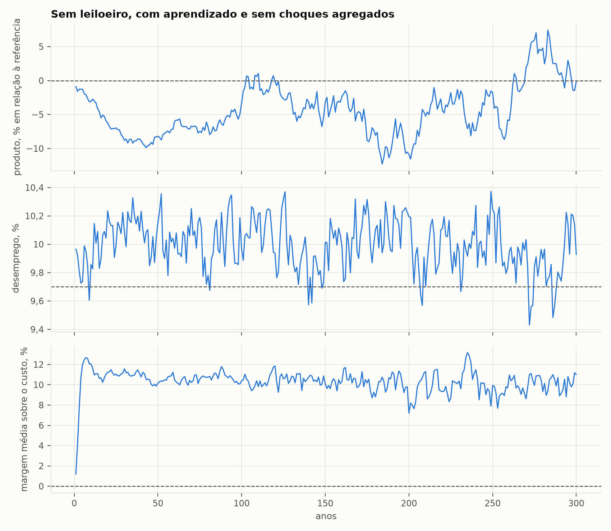
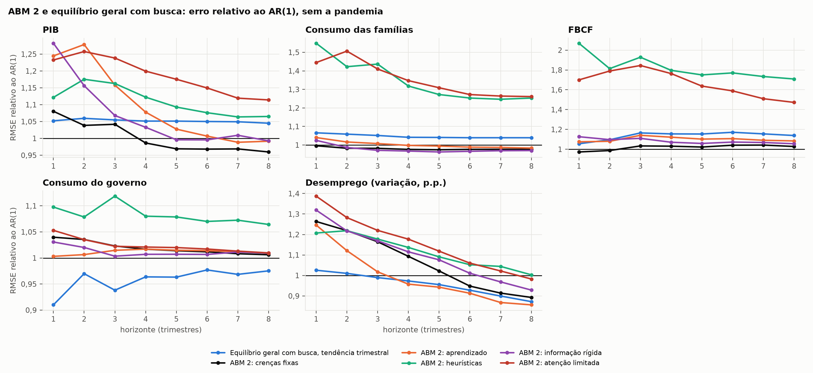

# ABM 2 sem leiloeiro

Este modelo é o [ABM 1](../abm1_com_leiloeiro/README.md) sem o leiloeiro, com
200 firmas que fixam preços e salários, um mercado de trabalho com busca e um
mercado de bens em que cada família compra de poucos fornecedores. As
famílias, a calibração e as regras de expectativas continuam as mesmas, mas o
desemprego, a margem das firmas, o salário real e o retorno do capital passam
a sair das decisões dos agentes, e não de um equilíbrio. O modelo serve à
previsão fora da amostra desta pasta ([`../README.md`](../README.md)), em que
seu par no equilíbrio geral é o [modelo com margem e
busca](../dsge_busca/README.md), e à análise da [Lei
15.270](../../../../Politicas/Lei-15270/README.md#no-abm-sem-leiloeiro).

## A economia

No [ABM 1](../abm1_com_leiloeiro/README.md) os preços vêm de um leiloeiro
walrasiano, que em `descentralizada.py` deixa de existir, de modo que cada
mercado passa a funcionar por conta dos agentes, como resume a tabela.

| Mercado | Quem decide | Como |
|---|---|---|
| Trabalho | 200 firmas heterogêneas em produtividade | cada firma abre vagas quando quer mais gente e demite quando quer menos, o desempregado se candidata às firmas com vagas atraído pelo salário e o desemprego é o que sobra |
| Salários | as firmas | quem não preenche a maior parte das vagas oferece mais e quem passa dois anos sem dificuldade oferece menos (Lengnick, 2013), com o salário revisto partindo da média do mercado, de modo que quem sobe paga pelo menos a média e quem corta paga no máximo a média |
| Bens | as famílias, com 3 fornecedores cada | compram do mais barato para o mais caro, a firma sem estoque raciona e quem é racionado procura outra firma, trocando de fornecedor de vez em quando |
| Preços | as firmas | margem sobre o custo unitário, revista com probabilidade 0,75 por trimestre, que é a frequência de reajustes no Brasil (Gouvea, 2007), e que sobe quando falta estoque e desce quando sobra |
| Produção e capital | as firmas | quadro ajustado aos poucos pelo estoque e investimento que repõe a depreciação e o crescimento de tendência e fecha 3% por trimestre da distância até o capital de custo mínimo, com o custo do capital dado pelo retorno que as famílias esperam |
| Riqueza | um fundo, dono das firmas | o retorno das famílias é o lucro realizado, e não o produto marginal |

O desempregado recebe do governo a mesma fração da renda do seu tipo que no
modelo de Aiyagari, mas não produz, e os fluxos de emprego vêm da mesma
cadeia trimestral da PNAD, que o emprego segue exatamente quando sobram vagas
e da qual se afasta, com mais desemprego, quando elas faltam. A referência é
o equilíbrio walrasiano com esses mesmos fundamentos, em que os desempregados
fora da produção reduzem o capital em 4% sem alterar o juro nem o salário. A
contabilidade fecha a cada trimestre, pois a riqueza das famílias mais o
saldo do governo é igual ao capital mais o valor dos estoques e o produto é
igual ao consumo mais o investimento, o gasto do governo e a variação dos
estoques. As regras das firmas vêm da literatura de ABM macro (Lengnick,
2013; Delli Gatti et al., 2011), convertidas para trimestres.

Chegar a uma economia estável deu trabalho, e o caminho até ela diz algo
sobre os mecanismos em jogo, porque as primeiras versões explodiram ou
colapsaram e cada falha apontou um deles. A regra de Lengnick sobe o salário
sempre que falta gente, e com busca sempre falta alguém, de modo que, com
margem fixa, o salário real crescia sem limite, já que o preço repassava só a
parte do trabalho no custo. Firmas que aprendiam a demanda pelas vendas não
percebiam a demanda que deixavam de atender e ficavam presas num racionamento
permanente. Quando o investimento comprava antes das famílias, o
racionamento virava poupança forçada, que virava mais capital, derrubava o
juro e aumentava a demanda, sem fim. E firmas que ajustavam o quadro de uma
vez levavam a economia ao colapso, com desemprego de 100%. A versão final
ajusta o quadro aos poucos, deixa a margem subir quando falta produto, dá
prioridade às famílias no mercado de bens e mede a demanda pelas vendas
somadas ao que ficou sem atender.

Duas correções vieram depois, na preparação do ABM 2 para a previsão. A
primeira ancora os salários na média do mercado. Na regra original de
Lengnick cada firma sobe ou corta o próprio salário, que vira um passeio
aleatório, e a dispersão entre firmas passava de 8% e ainda subia depois de
300 anos, ao passo que, partindo da média, ela se estabiliza em cerca de 5%.
A segunda faz o investimento repor também o crescimento de tendência. Como a
firma repunha só a depreciação, o capital ficava abaixo do alvo numa
proporção que dependia da velocidade de ajuste, 6% com os 10% por trimestre
usados antes, e com a reposição da tendência o capital de longo prazo deixa
de depender da velocidade. Essa velocidade, de 3% por trimestre, é o único
parâmetro do ABM 2 calibrado com dados, escolhido para que o desvio-padrão do
crescimento trimestral da FBCF na história de 1996 a 2013 guiada pelos dados
fique em 3,6 p.p., contra 3,5 p.p. nas Contas Nacionais. Com 10% por
trimestre esse desvio chegava a 12 p.p. e o investimento previsto oscilava
40% em dois anos. O período de calibração termina antes da primeira origem
da avaliação de previsões.

## O que emerge

A tabela traz as médias de 300 anos sem choques agregados, com 20 mil
famílias, descartados os 100 primeiros anos (`resultados/mercados_longo_prazo.csv`).

| | Walrasiano / PNAD | Aprendizado | Heurísticas | Atenção limitada |
|---|---|---|---|---|
| Produto (referência = 1) | 1 | 0,97 | 0,95 | 0,96 |
| Capital | 1 | 0,87 | 0,85 | 0,85 |
| Salário real | 1 | 0,90 | 0,88 | 0,89 |
| Juro líquido | 10,24% | 10,51% | 10,63% | 10,74% |
| Desemprego | 9,7% | 10,0% | 10,0% | 9,9% |
| Margem sobre o custo | 0 | 10,2% | 10,4% | 10,5% |
| Participação do trabalho | 54,9% | 50,8% | 50,8% | 50,8% |
| Procura há até 1 ano / 1 a 2 anos / mais de 2 | 64 / 14 / 22% | 63 / 14 / 22% | 63 / 14 / 22% | 63 / 14 / 22% |
| Famílias que não acham o produto em algum fornecedor | 0 | 42% | 42% | 42% |
| Desvio do crescimento anual do produto | — | 1,4 p.p. | 1,4 p.p. | 1,3 p.p. |
| Desvio do desemprego | — | 0,19 p.p. | 0,18 p.p. | 0,18 p.p. |



Sem que ninguém o imponha, o desemprego fica em 10%, perto dos 9,7% da PNAD,
e a distribuição do tempo de procura coincide com a da tabela 1616 do IBGE.
Parte disso vem da calibração, porque a busca reproduz a cadeia da PNAD
quando sobram vagas, e o que se acrescenta, cerca de 0,3 p.p., vem das
demissões e das vagas que ficam abertas.

Também o poder de mercado emerge, com margens de 10% sobre o custo, porque as
famílias comparam poucos fornecedores e descobrem devagar as firmas mais
baratas. O salário real fica 10% a 12% abaixo do walrasiano, a participação
do trabalho cai de 55% para 51% e o capital, que as firmas dimensionam pelo
custo, fica 13% a 15% abaixo, enquanto o produto cai menos, de 3% a 5%,
porque a produção migra para as firmas mais produtivas. É a distorção
clássica do poder de mercado, aqui sem que ninguém a tenha posto no modelo.
O juro, por sua vez, fica no lugar, já que o retorno do fundo, que é o lucro
realizado, fica a 0,3–0,5 p.p. do juro walrasiano, com a poupança das
famílias se ajustando até que o capital renda o que elas exigem.

Mesmo sem nenhum choque agregado surgem ciclos, e o produto oscila em ondas
longas, de −12% a +7% em relação à média ao longo de décadas, com um desvio
do crescimento anual de 1,3 a 1,4 p.p., metade dos 2,7 p.p. do PIB brasileiro
desde 1997. Esses ciclos vêm do capital, das margens e da produtividade das
firmas, e não do mercado de trabalho, pois o desemprego quase não se mexe,
com desvio de 0,2 p.p. contra 2,9 p.p. na PNAD, e não aparecem nem a lei de
Okun nem a curva de Beveridge. O ABM descentralizado ainda não gera ciclos de
desemprego como os brasileiros.

### Sensibilidade

A tabela usa a regra de aprendizado, com a média de duas sementes nos últimos
100 de 150 anos (`resultados/mercados_sensibilidade.csv`).

| Variante | Produto | Capital | Salário real | Desemprego | Margem |
|---|---|---|---|---|---|
| Base | 0,95 | 0,84 | 0,89 | 10,0% | 10,6% |
| Margem máxima de 10% (em vez de 15%) | 0,97 | 0,89 | 0,93 | 9,9% | 7,5% |
| Margem máxima de 25% | 0,91 | 0,75 | 0,81 | 10,3% | 16,0% |
| Revisão de preço com probabilidade 0,5 | 0,94 | 0,82 | 0,87 | 10,0% | 10,7% |
| Passo do salário de 1,5% ou de 6% | 0,94–0,96 | 0,82–0,86 | 0,87–0,90 | 10,0% | 10,3–10,8% |
| Procura de fornecedor 0,1 ou 0,5 | 0,95–0,96 | 0,84 | 0,88–0,89 | 10,0% | 10,1–10,5% |
| 100 ou 400 firmas | 0,94–0,95 | 0,83–0,84 | 0,88–0,89 | 9,8–10,2% | 10,4–10,7% |
| Depreciação do estoque de 2% ou 10% | 0,94–0,98 | 0,82–0,87 | 0,87–0,91 | 10,0–10,1% | 9,6–11,4% |

O desemprego e o juro quase não dependem das regras, e a margem depende de
uma só, ficando em cerca de dois terços do teto que as firmas se permitem. O
modelo mostra, portanto, que o poder de mercado emerge e para que lado ele
empurra salários e capital, mas não fixa o seu tamanho, que exigiria
calibrar o teto com margens medidas nos dados.

## Verificação

Os 21 testes (`test_*.py`) conferem, a cada trimestre, que a riqueza das
famílias mais o saldo do governo é igual ao capital mais os estoques e que o
produto é a soma das demandas mais a variação dos estoques, que a busca
reproduz a cadeia de emprego da PNAD quando sobram vagas, que nenhuma firma
vende mais do que tem e que, sem receita nova, mudar a forma de devolução
não muda nada, já que só a receita da reforma segue os pesos da devolução.
Na história guiada pelos dados, o ABM 2 reproduz o PIB e o gasto observados
com erro de $10^{-14}$ e a taxa de desemprego da PNAD com erro médio de
0,05 p.p., e a busca da separação que gera o desemprego observado não altera
os números aleatórios do resto do trimestre.

## Previsão fora da amostra

Em cada origem, `previsao_descentralizada.py` usa apenas o que se sabia
naquela data. O modelo parte da mesma calibração do ABM 1, com dados anuais
até dois anos antes, PNAD até a origem e tendência dada pelo PIB trimestral
até a origem, agora com os desempregados fora da produção, e passa por 100
anos de aquecimento sem choques, a partir da referência walrasiana, para que
margens, estoques, capital e crenças cheguem ao regime do próprio ABM, com o
mesmo descarte da análise de longo prazo. Em seguida percorre a história de
1996 até a origem, reproduzindo o PIB pelo crescimento da produtividade, o
gasto do governo e, desde 2012, a taxa de desemprego da PNAD pela
probabilidade de separação de cada trimestre, estima um AR(1) para os três
choques, com resíduos correlacionados, e faz 200 simulações de T+1 a T+8 com
choques antitéticos. Com isso prevê o crescimento acumulado do PIB, do
consumo, da FBCF e do consumo do governo e a variação do desemprego.

A tabela mostra o RMSE relativo ao AR(1) em 8 trimestres, com a amostra toda
e sem as janelas da pandemia, com as diferenças significativas a 5% pelo
teste de Diebold-Mariano em negrito.

| Modelo | PIB | PIB sem pandemia | Consumo | Consumo sem pandemia | FBCF | FBCF sem pandemia | Desemprego | Desemprego sem pandemia |
|---|---|---|---|---|---|---|---|---|
| Equilíbrio geral com busca (tend. trimestral) | 0,97 | 1,05 | 0,95 | 1,04 | 1,10 | 1,14 | 0,81 | 0,87 |
| ABM 2: crenças fixas | 0,97 | 0,96 | 0,95 | 0,98 | 1,04 | 1,03 | 0,78 | 0,89 |
| ABM 2: aprendizado | **0,95** | 0,99 | 0,94 | 0,98 | 1,07 | **1,08** | 0,76 | 0,86 |
| ABM 2: heurísticas | 1,07 | **1,07** | **1,15** | 1,25 | **1,68** | **1,71** | 1,00 | 1,00 |
| ABM 2: informação rígida | 0,94 | 0,99 | 0,90 | 0,97 | 1,03 | 1,06 | 0,82 | 0,93 |
| ABM 2: atenção limitada | 1,01 | 1,11 | 1,14 | **1,26** | **1,45** | **1,47** | 0,85 | 0,98 |



Com crenças fixas, aprendizado e informação rígida, o ABM 2 fica no nível do
seu par no equilíbrio geral, errando o mesmo no PIB, um pouco menos no
consumo e menos na FBCF sem a pandemia, e com informação rígida chega a ser o
melhor de todos os modelos para o consumo na amostra toda. No desemprego, ele
e o par batem o AR(1) em um e dois anos, e com aprendizado o ABM 2 erra 24%
menos que o AR(1) em 8 trimestres, ou 14% menos sem a pandemia, o melhor
resultado para essa variável. Os dois modelos trazem o desemprego de volta à
média da PNAD, enquanto as referências extrapolam a tendência recente, o que
explica também por que o AR(1) é melhor em um trimestre.

Com heurísticas e atenção limitada o ABM 2 fica instável. O retorno do
capital é o lucro realizado do fundo, que oscila, e essas regras o levam
quase direto às crenças, de modo que o custo do capital das firmas e o
consumo oscilam junto e os erros na FBCF ficam de 45% a 80% maiores que os do
AR(1), com o agravante de que, sob heurísticas, as famílias ainda trocam de
regra em bloco. No ABM 1, em que o retorno é o produto marginal, essas mesmas
regras são as melhores para a FBCF. As tabelas completas e as previsões
registradas para 2026–2028 estão no [README da previsão](../README.md).

## Como rodar

Os comandos rodam a partir da pasta `Econometria/`, com as dependências de
`Python/requirements.txt`.

```bash
python Python/macroeconomia/Forecast/Brasil/2013T4-2026T2/abm2_sem_leiloeiro/experimentos_mercados.py   # o que emerge e sensibilidade (cerca de 3 minutos)
python Python/macroeconomia/Forecast/Brasil/2013T4-2026T2/comparacao.py --processos 4 --modelos abm2_eq abm2_apr abm2_heu abm2_inf abm2_aten
python -m unittest discover -s Python/macroeconomia/Forecast/Brasil/2013T4-2026T2/abm2_sem_leiloeiro -v
```

## Arquivos

| Arquivo | Conteúdo |
|---|---|
| `descentralizada.py` | a economia sem leiloeiro, com firmas, preços, salários, busca, mercado de bens e fundo, e a referência walrasiana com os mesmos fundamentos |
| `previsao_descentralizada.py` | o ABM no protocolo de previsão, com aquecimento, história que reproduz PIB, gasto e desemprego, choques e réplicas |
| `experimentos_mercados.py` | o que emerge sem choques agregados e a sensibilidade às regras das firmas |
| `test_*.py` | 21 testes |
| `resultados/`, `figuras/` | tabelas e figuras |

As famílias e as regras de expectativas vêm de `../abm1_com_leiloeiro/`.

## Limitações e próximos passos

A limitação mais imediata é o retorno ruidoso do capital. O retorno das
famílias é o lucro realizado do fundo, que oscila de um trimestre para outro,
e as regras de heurísticas e de atenção limitada o levam quase direto às
crenças e ao custo do capital das firmas, de modo que o próximo ajuste é
suavizar o retorno que entra nas crenças ou dar às firmas um custo do capital
de longo prazo.

Há também a forma como as recessões entram no modelo. Na história guiada
pelos dados, os dois ABMs explicam a queda do PIB pelo crescimento da
produtividade, e o ABM 2 explica o desemprego pela separação. Numa recessão a
produtividade cai, o capital por unidade de eficiência sobe e o retorno do
capital cai, e no ABM 2 com heurísticas as famílias que levam o retorno
corrente às crenças baixam o custo do capital das firmas, fazendo o
investimento do modelo subir na recessão de 2015 e cair depois, justamente
quando nos dados ele se recuperava. Falta o canal de demanda e de crédito que
fez o investimento brasileiro cair em 2015–2016. Pelo mesmo motivo, sem
leiloeiro o produto flutua sozinho mas o desemprego não, ficando no nível
friccional, e faltam os canais que fazem o desemprego brasileiro oscilar,
como o crédito, a entrada e saída de firmas e a política monetária. O tamanho
da margem que emerge, por sua vez, depende do teto que as firmas se
permitem, e calibrá-lo com margens medidas nos dados é uma extensão natural.

Depois disso, a ideia é levar os dois modelos para vários setores, com a
matriz insumo-produto e as Tabelas de Recursos e Usos do IBGE agregadas em
cerca de 12 setores, e registrar cada transação. No equilíbrio geral isso
significa firmas heterogêneas com variedades CES e uma rede de insumos
calibrada na matriz do IBGE, como em Bernard, Moxnes e Saito (2019) e Baqaee
e Farhi (2019), em que o fluxo de cada família para cada firma e de cada
firma para cada fornecedor fica determinado pelo equilíbrio e pode ser
calculado a qualquer momento sem ser gravado, o que dá a matriz de
contabilidade social completa. No ABM significa firmas por setor, mercados
descentralizados, um banco e um livro-razão de partidas dobradas que registra
quem pagou, quem recebeu, o quê, em que trimestre e por quanto, no espírito
dos modelos *stock-flow consistent* (Godley e Lavoie, 2007; Caiani et al.,
2016) e do ABM da Áustria de Poledna et al. (2023), em que todo agregado
passa a ser uma soma de linhas do livro e os testes verificam que as três
óticas do PIB fecham. Com isso será possível comparar a rede densa de
transações do equilíbrio com a rede esparsa que emerge no ABM, e as duas com
a matriz do IBGE.

Resta, por fim, o que ainda é imposto. Com o leiloeiro os mercados se
equilibram a cada trimestre e sem ele não, mas em ambos os casos as famílias
ainda formam suas políticas com o risco de desemprego da PNAD, e não com o
que de fato vivem, a tabela de políticas supõe o perfil de transferências do
estado estacionário e as regras de crenças fixas e de atenção limitada
conhecem o equilíbrio por definição.
