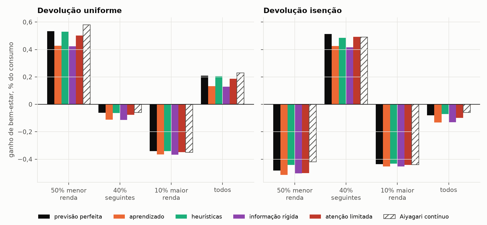
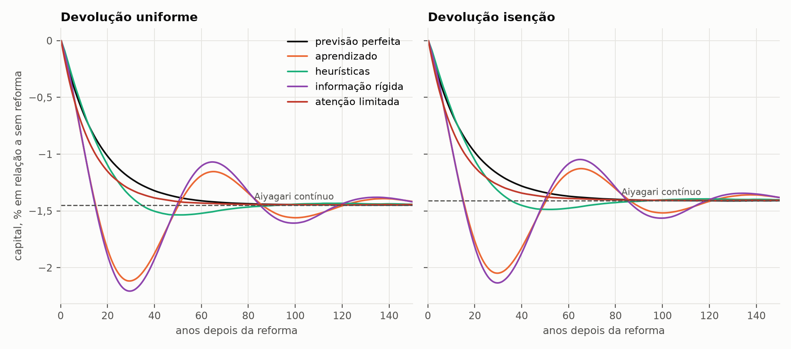
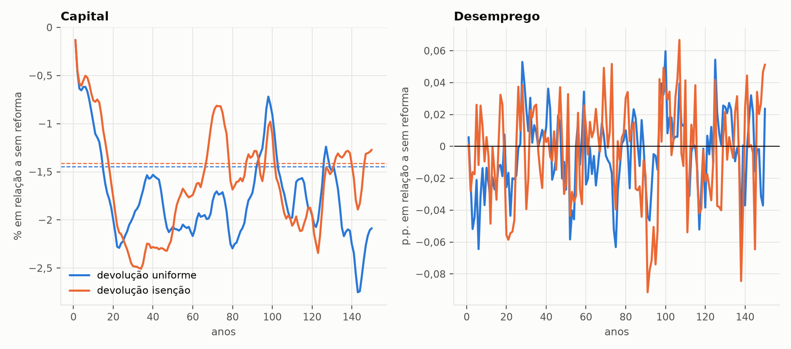

# Lei 15.270/2025: tributação da renda do capital

Os efeitos de um aumento da tributação da renda do capital do tamanho da Lei
15.270/2025 (+0,85 p.p. na alíquota efetiva sobre a renda líquida do
capital), em três modelos calibrados para o Brasil:

| Pasta | Modelo | Pergunta |
|---|---|---|
| [`equilibrio_geral/`](equilibrio_geral/README.md) | Ramsey-Cass-Koopmans com governo e Aiyagari com famílias heterogêneas, em tempo contínuo, com a [nota técnica](equilibrio_geral/nota_tecnica.pdf) | quanto a economia perde e quem ganha e quem perde |
| `abm1_com_leiloeiro/` | o [ABM com leiloeiro](../../Forecast/Brasil/2013T4-2026T2/abm1_com_leiloeiro/README.md), com cinco regras de expectativas | os resultados mudam quando as famílias não são plenamente racionais |
| `abm2_sem_leiloeiro/` | o [ABM sem leiloeiro](../../Forecast/Brasil/2013T4-2026T2/abm2_sem_leiloeiro/README.md), com firmas, preços, salários e busca | os resultados mudam quando os preços não vêm de um equilíbrio |

Os códigos dos dois ABMs ficam na pasta de previsão
([`Forecast/Brasil/2013T4-2026T2/`](../../Forecast/Brasil/2013T4-2026T2/README.md)),
porque servem também à previsão; aqui ficam os experimentos da lei, os
resultados e as figuras. A calibração do equilíbrio geral, por sua vez, é
usada pelos modelos de previsão.

Nos três modelos, a lei entra como um aumento uniforme de $\tau_k$ sobre todo
o capital. A [nota técnica](equilibrio_geral/nota_tecnica.pdf) explica por que
essa tradução tende a exagerar a queda do capital: um quarto da receita nova
vem de não residentes, e um imposto sobre dividendos pode afetar pouco o
investimento financiado com lucros retidos.

## No equilíbrio geral

No longo prazo, com agente representativo, o capital cai 1,46%, o PIB e os
salários caem 0,66%, o consumo cai 0,63%, e o bem-estar, 0,084% do consumo; a
receita de longo prazo fica em 90% da estática. Com famílias heterogêneas, o
agregado quase não muda, e quem ganha depende da devolução. Devolvida igual
para todos, a receita nova dá à metade mais pobre um ganho de 0,58% do
consumo. Devolvida só aos empregados do grupo intermediário, como a isenção
do imposto de renda da lei, a metade mais pobre perde 0,42%. Se o grupo
intermediário recebe só o equivalente à renúncia oficial com a isenção
(R$ 25,84 bi dos R$ 34,12 bi) e o resto volta a todos, a perda da metade mais
pobre cai para 0,18%; se só a receita do aumento da alíquota vai para o grupo
intermediário e o que os outros impostos deixam de arrecadar se divide entre
todos, ela sobe para 0,60%. Os detalhes estão no
[README do modelo](equilibrio_geral/README.md) e na
[nota técnica](equilibrio_geral/nota_tecnica.pdf).

## No ABM com leiloeiro

O experimento é o mesmo de [`equilibrio_geral/`](equilibrio_geral/README.md):
+0,85 p.p. em $\tau_k$, de surpresa, com a receita nova devolvida igual para
todos ou só aos empregados do grupo intermediário, a faixa beneficiada pela
isenção do imposto de renda. Para cada regra, a economia com e sem reforma
parte do mesmo equilíbrio e recebe os mesmos sorteios de renda de cada
família; o bem-estar é a utilidade descontada que cada família de fato obtém
em 150 anos.

Ganho médio de bem-estar, em % do consumo (entre parênteses, % que ganham):

| Devolução | Grupo | Previsão perfeita | Aprendizado | Heurísticas | Informação rígida | Atenção limitada | Aiyagari contínuo |
|---|---|---|---|---|---|---|---|
| Uniforme | 50% com menor renda | +0,53 (100) | +0,43 (100) | +0,53 (100) | +0,42 (100) | +0,50 (100) | +0,58 (100) |
| Uniforme | 40% seguintes | −0,06 (29) | −0,11 (5) | −0,06 (28) | −0,11 (4) | −0,08 (21) | −0,06 (29) |
| Uniforme | 10% com maior renda | −0,34 (0) | −0,37 (0) | −0,34 (0) | −0,37 (0) | −0,35 (0) | −0,35 (0) |
| Uniforme | Todos | +0,21 (61) | +0,13 (52) | +0,21 (61) | +0,13 (52) | +0,19 (58) | +0,23 (62) |
| Isenção | 50% com menor renda | −0,48 (0) | −0,51 (0) | −0,44 (0) | −0,50 (0) | −0,50 (0) | −0,42 (0) |
| Isenção | 40% seguintes | +0,51 (99) | +0,43 (99) | +0,49 (99) | +0,42 (99) | +0,49 (99) | +0,49 (100) |
| Isenção | 10% com maior renda | −0,44 (0) | −0,45 (0) | −0,43 (0) | −0,45 (0) | −0,44 (0) | −0,44 (0) |
| Isenção | Todos | −0,08 (40) | −0,13 (40) | −0,07 (40) | −0,13 (40) | −0,10 (40) | −0,06 (40) |



Em todas as regras, a devolução uniforme beneficia a metade mais pobre (de
+0,42% a +0,53% do consumo) e a devolução que imita a lei a prejudica (de
−0,44% a −0,51%), como no modelo contínuo. O que muda com a regra é o
tamanho. Com aprendizado e com informação rígida, o ganho agregado da
devolução uniforme encolhe cerca de um terço (+0,13% contra +0,21% com
previsão perfeita), e quase ninguém do grupo intermediário ganha (5% e 4%,
contra 29%).

A razão está no caminho do capital. Logo depois da reforma, o juro líquido
cai. Quem tem previsão perfeita sabe que ele volta a subir à medida que o
capital diminui; quem aprende com o passado toma a queda como permanente.
Como a poupança é muito sensível ao juro esperado (o juro de equilíbrio fica
só 0,17 p.p. abaixo do ponto em que a poupança explode), essas famílias
poupam de menos, o capital cai além do novo estado estacionário (−2,1% a
−2,2% por volta de 30 anos, contra −1,45% no longo prazo), o juro sobe de novo
e elas corrigem tarde. O ajuste vira uma sequência de ciclos longos e
amortecidos, com custo de bem-estar maior; com previsão perfeita, o ajuste é
monótono. No longo prazo, o capital fica praticamente onde o modelo contínuo
prevê em todas as regras: nos últimos 20 anos, de −1,39% a −1,45% com a
devolução uniforme e de −1,36% a −1,41% com a isenção.

As heurísticas e a atenção limitada ficam perto da previsão perfeita em
parte por construção. As duas ancoram parte das crenças no novo estado
estacionário, que as famílias conhecem desde o dia da reforma. Só o
aprendizado e a informação rígida dependem inteiramente do passado.



Os parâmetros comportamentais vêm da literatura, e a devolução uniforme foi
refeita com valores abaixo e acima de cada um
(`abm1_com_leiloeiro/resultados/sensibilidade.csv`):

| Regra | Parâmetro | 50% com menor renda | 40% seguintes | 10% com maior renda | Todos | Menor capital no caminho |
|---|---|---|---|---|---|---|
| Aprendizado | ganho 0,01 | +0,39 | −0,13 | −0,37 | +0,11 | −2,9% |
| Aprendizado | ganho 0,05 | +0,46 | −0,10 | −0,36 | +0,15 | −1,6% |
| Heurísticas | intensidade 0,2 | +0,54 | −0,06 | −0,34 | +0,21 | −1,5% |
| Heurísticas | intensidade 5 | +0,51 | −0,07 | −0,35 | +0,19 | −1,5% |
| Informação rígida | $\lambda$ = 0,10 | +0,41 | −0,12 | −0,37 | +0,12 | −2,4% |
| Informação rígida | $\lambda$ = 0,50 | +0,43 | −0,11 | −0,37 | +0,13 | −2,1% |
| Atenção limitada | $\bar m$ = 0,70 | +0,54 | −0,06 | −0,34 | +0,21 | −1,4% |
| Atenção limitada | $\bar m$ = 0,95 | +0,48 | −0,08 | −0,35 | +0,17 | −1,4% |

Os sinais nunca mudam. O que pesa é a velocidade do aprendizado: quanto mais
devagar as famílias atualizam as crenças, maior a queda do capital antes da
recuperação e menor o ganho de bem-estar. As heurísticas e a atenção
limitada quase não dependem dos parâmetros.

Crer para sempre no estado estacionário não é expectativa racional fora dele.
Com essas crenças e sem reforma nenhuma, a economia se afasta sozinha do
equilíbrio: se o capital sobe um pouco, os salários e as transferências
sobem, as famílias poupam o excedente e o capital sobe mais (+0,2% em 25
anos, +1,6% em 75 e +8,4% em 150). Com aprendizado, a mesma economia fica no
equilíbrio (±0,4%), porque o equilíbrio de expectativas racionais é estável
sob aprendizado, como em Evans e Honkapohja (2001). Por isso o benchmark
neoclássico do experimento é a previsão perfeita, e não as crenças fixas
(`abm1_com_leiloeiro/resultados/estabilidade.csv`).

## No ABM sem leiloeiro

O mesmo aumento de $\tau_k$ na economia descentralizada, com aprendizado, em
96 sementes. Em cada semente, a economia roda 100 anos sem reforma, como na
previsão, até chegar ao regime do próprio ABM (margens de 10% sobre o custo,
capital 13% abaixo do walrasiano, desemprego perto de 10%), e daí se separa
em cópias com os mesmos números aleatórios.

A devolução segue outra regra. Só a receita do aumento da alíquota vai para
o grupo escolhido; o resto do orçamento, inclusive o que os outros impostos
deixam de arrecadar, se divide igualmente. Com a regra do Aiyagari e do ABM
com leiloeiro, em que a transferência inteira segue os pesos, o grupo da
devolução absorveria também as diferenças de ciclo entre as cópias com e
sem reforma. A comparação, por isso, é com o Aiyagari resolvido com a mesma
regra: na devolução uniforme as duas regras coincidem, e na isenção é a
conta "isenção, só a receita nova" de
[`equilibrio_geral/`](equilibrio_geral/README.md).

Depois da separação, as cópias com e sem reforma seguem caminhos
diferentes, e a mesma família é demitida, contratada e racionada em datas
diferentes. Isso atrapalha a medida de bem-estar usada no ABM com
leiloeiro, a média dos ganhos individuais. O ganho de cada família é uma
função convexa da razão entre os bem-estares com e sem reforma, e por isso
sorteios diferentes dão, em média, ganho positivo mesmo sem reforma
nenhuma. Uma quarta cópia, o placebo, fica sem reforma e só troca os
sorteios. Nela, a média dos ganhos individuais é de +1,09% do consumo
(+1,72% na metade mais pobre, que tem a renda mais volátil). A medida usada
aqui é o ganho utilitário de cada grupo, que soma o bem-estar das famílias
antes de convertê-lo em consumo. No placebo, ele fica em +0,33%, com
erro-padrão de 0,48, e não se distingue de zero.

Ganho utilitário em % do consumo, média de 96 sementes, com o erro-padrão
entre parênteses (`abm2_sem_leiloeiro/resultados/mercados_lei_15270_resumo.csv`):

| Devolução | Grupo | Sem leiloeiro | Aiyagari contínuo |
|---|---|---|---|
| Uniforme | 50% com menor renda | +1,07 (0,56) | +0,61 |
| Uniforme | 40% seguintes | −0,17 (0,21) | −0,04 |
| Uniforme | 10% com maior renda | −0,46 (0,11) | −0,34 |
| Uniforme | Todos | +0,82 (0,50) | +0,45 |
| Isenção | 50% com menor renda | −0,57 (0,50) | −0,60 |
| Isenção | 40% seguintes | +0,80 (0,19) | +0,61 |
| Isenção | 10% com maior renda | −0,45 (0,10) | −0,45 |
| Isenção | Todos | −0,34 (0,44) | −0,32 |
| Placebo | 50% com menor renda | +0,38 (0,55) | 0 |
| Placebo | 40% seguintes | +0,16 (0,21) | 0 |
| Placebo | 10% com maior renda | +0,06 (0,11) | 0 |
| Placebo | Todos | +0,33 (0,48) | 0 |

Nos últimos 20 anos dos 150 simulados:

| Devolução | Capital, sem leiloeiro | Novo equilíbrio walrasiano | Desemprego, sem leiloeiro |
|---|---|---|---|
| Uniforme | −1,1% (0,7) | −1,45% | −0,05 p.p. (0,10) |
| Isenção | −1,8% (0,6) | −1,39% | −0,09 p.p. (0,10) |
| Placebo | −0,2% (0,6) | 0 | −0,06 p.p. (0,10) |



As linhas tracejadas são o novo equilíbrio walrasiano. O placebo dá a
medida do ruído: sem reforma nenhuma, a média do capital em 96 sementes
chega a se afastar 1,7% da economia original.

Em todos os grupos, o ABM sem leiloeiro fica a pouco mais de um erro-padrão
do Aiyagari, no máximo, e a ordem de quem ganha e quem perde é a mesma. A
devolução uniforme favorece a metade mais pobre, a que imita a lei favorece
o grupo intermediário, e os 10% com maior renda perdem nas duas. Com preços
e salários fixados por firmas, busca e racionamento, as conclusões
distributivas não mudam. A lei também não mexe no desemprego, que depende
dos fluxos do mercado de trabalho e não do imposto sobre o capital.

O que o ABM não consegue é medir o efeito com precisão. Na metade mais
pobre, o erro-padrão de 0,5 p.p. é do tamanho do próprio efeito, e uma
semente sozinha não diz nada: nesse grupo, com a devolução uniforme, a
diferença entre as cópias com e sem reforma vai de −13,8% a +21,6% do
consumo, conforme o caminho que cada cópia toma depois da separação.
Reduzir o erro-padrão à metade exigiria quatro vezes mais
sementes. Família por família, o efeito também não aparece: em cada grupo,
cerca de metade ganha e metade perde, conforme o caminho que o sorteio lhe
deu.

## Como rodar

Da pasta `Econometria/`, com as dependências de `Python/requirements.txt`:

```bash
python Python/macroeconomia/Politicas/Lei-15270/equilibrio_geral/experimentos.py        # agente representativo
python Python/macroeconomia/Politicas/Lei-15270/equilibrio_geral/experimentos_ha.py     # famílias heterogêneas (grava a referência dos ABMs)
python Python/macroeconomia/Politicas/Lei-15270/abm1_com_leiloeiro/lei_com_leiloeiro.py # ABM com leiloeiro (cerca de 10 minutos)
python Python/macroeconomia/Politicas/Lei-15270/abm2_sem_leiloeiro/lei_sem_leiloeiro.py # ABM sem leiloeiro (cerca de 20 minutos com 4 núcleos)
python Python/macroeconomia/rodar_testes.py Lei-15270
```

## Referências

- Evans, G. W. e Honkapohja, S. (2001). *Learning and Expectations in Macroeconomics*. Princeton University Press.
- As demais estão na [nota técnica](equilibrio_geral/nota_tecnica.pdf) e nos READMEs dos [dois](../../Forecast/Brasil/2013T4-2026T2/abm1_com_leiloeiro/README.md#referências) [ABMs](../../Forecast/Brasil/2013T4-2026T2/abm2_sem_leiloeiro/README.md#referências).
