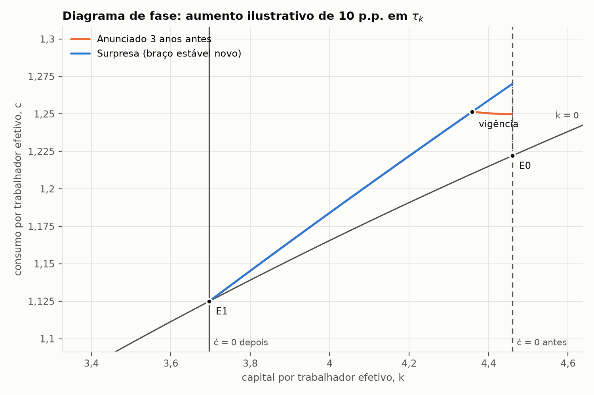
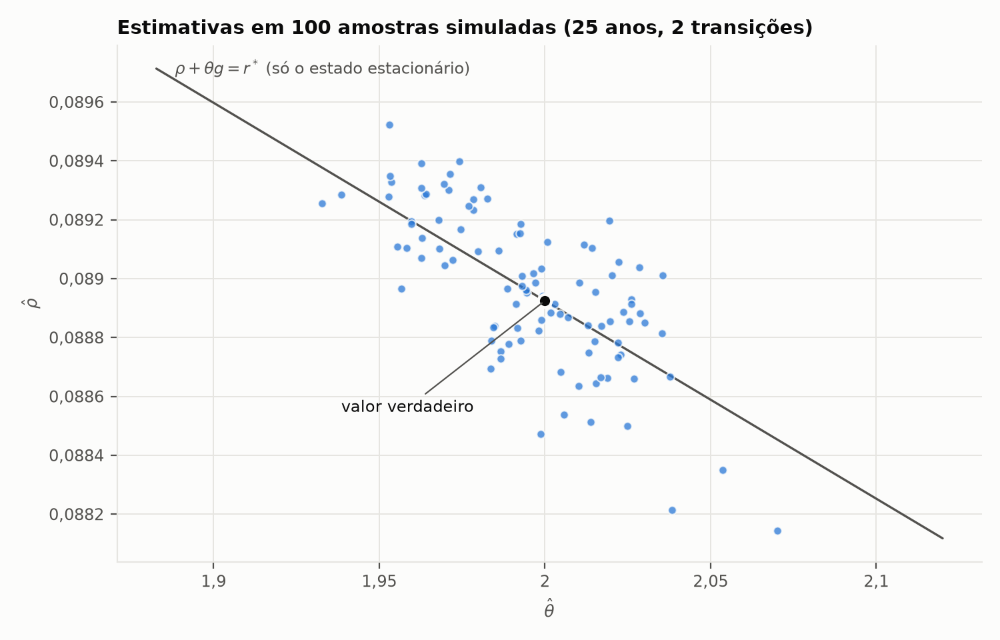
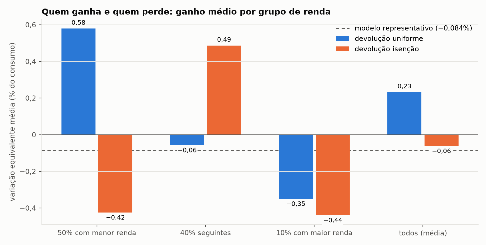

# Tributação do capital no Brasil em equilíbrio geral

Modelos de equilíbrio geral em **tempo contínuo**, calibrados com dados da
PWT 11.0, do Ipea e do IBGE, para medir os efeitos de um aumento da tributação
da renda do capital do tamanho da Lei 15.270/2025:

1. **Agente representativo** (Ramsey–Cass–Koopmans com governo): quanto a
   economia perde em capital, produto, salários e receita, no longo prazo e na
   transição, com choques inesperados e anunciados.
2. **Famílias heterogêneas** (Aiyagari, resolvido pelas equações de
   Hamilton–Jacobi–Bellman e Kolmogorov): quem ganha e quem perde, com risco de
   desemprego e desigualdade de renda calibrados com a PNAD Contínua.

A derivação completa, os algoritmos e a discussão estão na
[nota técnica](nota_tecnica.pdf).

## Parte 1 — agente representativo

Em unidades de trabalho efetivo ($k=K/AL$, $c=C/AL$), o equilíbrio é

$$
\dot k=k^\alpha-c-\hat g-(\delta+n+g)k,\qquad
\frac{\dot c}{c}=\frac{(1-\tau_k)(\alpha k^{\alpha-1}-\delta)-\rho-\theta g}{\theta},
$$

com imposto $\tau_k$ sobre a renda líquida do capital, imposto $\tau_c$ sobre o
consumo, gasto público $\hat g$ e transferências que fecham o orçamento. A
política pode mudar em datas conhecidas, o que cobre choques **inesperados**,
**anunciados** e **temporários**; os regimes são empilhados num único problema
de contorno.

Calibração (médias de 2000–2023): $\alpha=0{,}451$, $\delta=0{,}0605$,
$n=0{,}0143$, $g=0{,}0067$, $\theta=2$, $\tau_k=0{,}259$ (18% da renda bruta,
segundo Rabelo, 2025), $\rho=0{,}0889$ para reproduzir $K/Y=2{,}27$ e
$G/Y=0{,}192$. O investimento e o consumo, que não foram usados como alvo,
ficam próximos dos dados (18,5% e 62,3% do PIB no modelo, contra 17,9% e 60,9%).

A nova receita estimada para 2026 (R$ 34,12 bi) equivale a **+0,85 p.p.** na
alíquota efetiva sobre a renda líquida do capital. No longo prazo:

| Efeito | Valor |
|---|---|
| Estoque de capital | −1,46% |
| PIB e salários | −0,66% |
| Consumo | −0,63% |
| Receita estática | 0,268% do PIB |
| Receita de longo prazo | 0,242% do PIB (90% da estática) |
| Bem-estar (variação equivalente) | −0,084% do consumo |
| Pico da curva de Laffer | $\tau_k$ = 66% (hoje: 26%) |


O anúncio antecipado faz o consumo subir já na notícia e o capital começar a
cair antes da lei valer; na vigência, a economia chega exatamente ao novo braço
estável:



A nota traz ainda a curva de Laffer de longo prazo, um aumento temporário do
gasto público, um aumento anunciado do imposto sobre consumo e a sensibilidade
a $\theta$, à alíquota inicial e ao tamanho do choque.

### Estimação estrutural

`estimacao.py` estima $\rho$ e $\theta$ por mínimos quadrados não lineares em
dados sintéticos: consumo **integrado no ano** e capital **no fim do ano** de
duas transições de 25 anos, com erro de medida de 1%. Em 100 réplicas de
Monte Carlo o viés é desprezível, o erro-padrão bate com a dispersão das
estimativas e a cobertura dos intervalos de 95% é de 96%–97%. O estado
estacionário só identifica $\rho+\theta g$; são as transições que separam os
dois parâmetros:



## Parte 2 — famílias heterogêneas

Cada dinastia tem riqueza $a\ge0$ e produtividade $z$ que segue uma cadeia de
Markov; a família resolve

$$
\beta V_z(a)=\max_c\,u(c)+V_z'(a)\big[(\tilde r-n-g)a+(1-\tau_w)wz+T_z-c\big]
+\sum_{z'}q_{zz'}\big[V_{z'}(a)-V_z(a)\big],
$$

e a distribuição de riqueza sai da equação de Kolmogorov. O processo de renda
vem da PNAD Contínua (2012–2025):

- **risco de desemprego:** desocupação de 9,7%; a distribuição do tempo de
  procura é reproduzida exatamente por dois tipos de desempregado — 42% de
  curta duração (2,9 meses em média) e o resto de longa duração (2 anos);
- **desigualdade de renda:** três tipos permanentes (50% com menor renda, 40%
  seguintes, 10% com maior renda), com renda relativa 0,38 / 1,00 / 4,10,
  como na massa de rendimento do trabalho.

O Gini da renda no modelo é 0,48 (IBGE: 0,53). A riqueza é menos concentrada
que nos dados — 44% com os 10% mais ricos, contra cerca de 80% segundo o World
Inequality Database —, uma limitação conhecida desse tipo de modelo.

O mesmo aumento de 0,85 p.p. em $\tau_k$ é aplicado de surpresa, e o bem-estar
de cada família é medido incluindo toda a transição. A receita nova volta de
duas formas: **igual para todas as famílias** ou **só para os empregados do
grupo intermediário**, que contém a faixa de R$ 3 mil a R$ 7,35 mil beneficiada
pela isenção do imposto de renda na lei.

| Grupo | Devolução uniforme | Devolução isenção |
|---|---|---|
| 50% com menor renda | +0,58% (todos ganham) | −0,42% (todos perdem) |
| 40% seguintes | −0,06% (29% ganham) | +0,49% (todos ganham) |
| 10% com maior renda | −0,35% (todos perdem) | −0,44% (todos perdem) |
| Todos | +0,23% (62% ganham) | −0,06% (40% ganham) |



O agregado quase não muda em relação ao agente representativo (capital −1,45%
ou −1,41%, contra −1,46%), mas a distribuição muda tudo. Com a devolução que
imita a lei, a metade mais pobre, já isenta, perde: ela arca com a queda dos
salários que a redução do capital provoca, sem receber a isenção.

## Como rodar

Da pasta `Econometria/`, com as dependências de `Python/requirements.txt`:

```bash
python Python/macroeconomia/equilibrio_geral/calibracao.py          # calibração
python Python/macroeconomia/equilibrio_geral/experimentos.py        # parte 1: experimentos e figuras
python Python/macroeconomia/equilibrio_geral/estimacao.py --replicas 100
python Python/macroeconomia/equilibrio_geral/calibracao_renda.py    # processo de renda (PNAD)
python Python/macroeconomia/equilibrio_geral/experimentos_ha.py     # parte 2 (cerca de 3 minutos)
python -m unittest discover -s Python/macroeconomia/equilibrio_geral -v
```

Os dados ficam em [`dados/brasil/`](../../../dados/brasil/README.md), com os
scripts que os baixam. A nota compila com `latexmk -pdf nota_tecnica.tex`
nesta pasta.

## Arquivos

| Arquivo | Conteúdo |
|---|---|
| `modelo.py` | agente representativo: estado estacionário, transição com vários regimes (problema de contorno), fluxos anuais, bem-estar |
| `calibracao.py` | alvos a partir dos dados, calibração e momentos |
| `experimentos.py` | parte 1: experimentos de política, sensibilidade e figuras |
| `estimacao.py` | simulação, estimação de $\rho$ e $\theta$ e Monte Carlo |
| `aiyagari.py` | famílias heterogêneas: HJB e Kolmogorov por diferenças finitas, equilíbrio, calibração de $\rho$, transição e bem-estar individual |
| `calibracao_renda.py` | risco de desemprego e tipos de renda a partir da PNAD Contínua |
| `experimentos_ha.py` | parte 2: quem ganha e quem perde, desigualdade e figuras |
| `test_*.py` | 53 testes: equações, soluções exatas, identidades contábeis, calibrações, experimentos e estimação |
| `nota_tecnica.tex`, `.pdf` | derivação, métodos, resultados e referências |

A [versão em Julia](../../../Julia/macroeconomia/equilibrio_geral/ramsey.jl)
refaz a calibração e resolve a parte 1 por *reverse shooting*, um algoritmo
diferente; os resultados coincidem com os do Python até a 6ª casa decimal.
