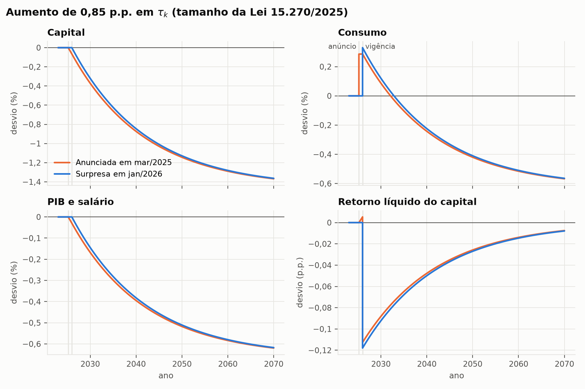

# Economics

Modelos econômicos quantitativos e econométricos, escritos para serem lidos e
não só executados. Cada modelo vem com o código, os dados que ele usa e uma
explicação do que está sendo estimado, para que dê para acompanhar o raciocínio
do começo ao fim.

A maior parte do material está em
[`Economia-Aplicada/`](Economia-Aplicada/README.md) e se
divide em duas frentes:

- **Econometria aplicada** — as mesmas técnicas implementadas em R, Python,
  Julia e C, rodando sobre os mesmos dados. Como os coeficientes têm que bater
  entre as linguagens, uma implementação serve de conferência para a outra.
- **Equilíbrio geral em tempo contínuo** — um estudo sobre a tributação da
  renda do capital no Brasil, calibrado com dados reais e com uma nota técnica
  em LaTeX.

## O que tem aqui

### Econometria em quatro linguagens

| Área | Modelo | R | Python | Julia | C |
|---|---|:-:|:-:|:-:|:-:|
| Macroeconometria | AR(1) por OLS | ✓ | ✓ | ✓ | ✓ |
| Microeconometria | Painel com efeitos fixos (LSDV) | ✓ | ✓ | ✓ | ✓ |
| Finanças | CAPM | ✓ | ✓ | ✓ | ✓ |
| Avaliação de política | Diferença-em-diferenças | ✓ | ✓ | ✓ | ✓ |
| Macroeconomia | Ramsey–Cass–Koopmans com governo | | ✓ | ✓ | |
| Macroeconomia | Aiyagari (famílias heterogêneas) | | ✓ | | |

Os exemplos econométricos usam datasets sintéticos gerados com seed fixa, com
o processo gerador conhecido (por exemplo, um ATT de 3,0 no DID e um beta de
1,2 no CAPM). Assim dá para ver se o estimador recupera o parâmetro verdadeiro.

As dependências foram mantidas no mínimo: R e Julia usam só a biblioteca
padrão, o C usa apenas `libc` e `libm` (o OLS é resolvido à mão, por
Gauss-Jordan), e o Python usa numpy, pandas, scipy, statsmodels e matplotlib.

### Tributação do capital no Brasil

O projeto em
[`equilibrio_geral/`](Economia-Aplicada/Econometria/Python/macroeconomia/equilibrio_geral/README.md)
mede os efeitos de um aumento da tributação da renda do capital do tamanho
previsto na Lei 15.270/2025, com parâmetros calibrados a partir da PWT 11.0,
do Ipea e do IBGE.

1. **Agente representativo.** No longo prazo, o aumento de 0,85 p.p. na
   alíquota efetiva reduz o capital em 1,46% e o PIB e os salários em 0,66%.
   A receita de longo prazo fica em 90% da estática. O modelo trata choques
   inesperados, anunciados e temporários, e inclui uma estimação estrutural
   com Monte Carlo.
2. **Famílias heterogêneas.** Com risco de desemprego e desigualdade de renda
   calibrados pela PNAD Contínua, o resultado agregado quase não muda, mas a
   distribuição muda bastante: dependendo de como a receita é devolvida, a
   metade mais pobre sai ganhando ou perdendo.



A derivação completa, os algoritmos e a discussão dos resultados estão na
[nota técnica](Economia-Aplicada/Econometria/Python/macroeconomia/equilibrio_geral/nota_tecnica.pdf).
A versão em Julia resolve o mesmo modelo por outro algoritmo (*reverse
shooting*) e chega aos mesmos números até a 6ª casa decimal.

## Estrutura

```
Economia-Aplicada/
└── Econometria/
    ├── R/          # base R, sem pacotes externos
    ├── Python/     # inclui os modelos de equilíbrio geral
    ├── Julia/      # biblioteca padrão
    ├── C/          # C puro, com OLS próprio em comum/
    └── dados/      # datasets sintéticos + dados reais do Brasil (brasil/)
```

Dentro de cada linguagem, os modelos ficam separados por área:
`macroeconometria/`, `microeconometria/`, `financas/`,
`trabalho_desenvolvimento/` e `macroeconomia/`.

## Como rodar

Todos os scripts leem os dados por caminho relativo, então os comandos devem
ser executados a partir da pasta `Econometria/`:

```bash
git clone https://github.com/JoseUfscar/Economics.git
cd Economics/Economia-Aplicada/Econometria
```

**Python**

```bash
python3 -m venv .venv
source .venv/bin/activate
pip install -r Python/requirements.txt
python3 Python/macroeconometria/ar1.py
```

**R**

```bash
Rscript R/microeconometria/painel_fe.R
```

**Julia** (testado na 1.10)

```bash
julia Julia/financas/capm.jl
```

**C**

```bash
make -C C
./C/bin/diff_in_diff
```

Os comandos dos modelos de equilíbrio geral (calibração, experimentos,
estimação e testes) estão no
[README do projeto](Economia-Aplicada/Econometria/Python/macroeconomia/equilibrio_geral/README.md).
Cada pasta de linguagem também tem seu próprio README, com mais detalhes.

## Dados

- **Sintéticos** — `macro_series.csv`, `painel.csv`, `financas.csv` e
  `did.csv`, gerados por `dados/gerar_dados.py`. O processo gerador de cada
  um está descrito em
  [`dados/README.md`](Economia-Aplicada/Econometria/dados/README.md).
- **Brasil** — séries da Penn World Table 11.0, do Ipea (estoque de capital) e
  do IBGE (Contas Nacionais e PNAD Contínua). Os CSVs ficam versionados para
  que tudo rode sem internet, e os scripts de download estão junto. Fontes,
  unidades e códigos de cada série em
  [`dados/brasil/README.md`](Economia-Aplicada/Econometria/dados/brasil/README.md).

## Adicionando um modelo

- Um arquivo por modelo, na pasta da área correspondente, com um nome que diga
  o que ele é (`var.py`, `garch.jl`, `logit.R`).
- Um cabeçalho curto com a equação estimada e o comando para rodar.
- Sempre que possível, usar os dados de `dados/`, para que o resultado possa
  ser comparado com as outras linguagens.

## Autor

José Oliveira — [@JoseUfscar](https://github.com/JoseUfscar)
